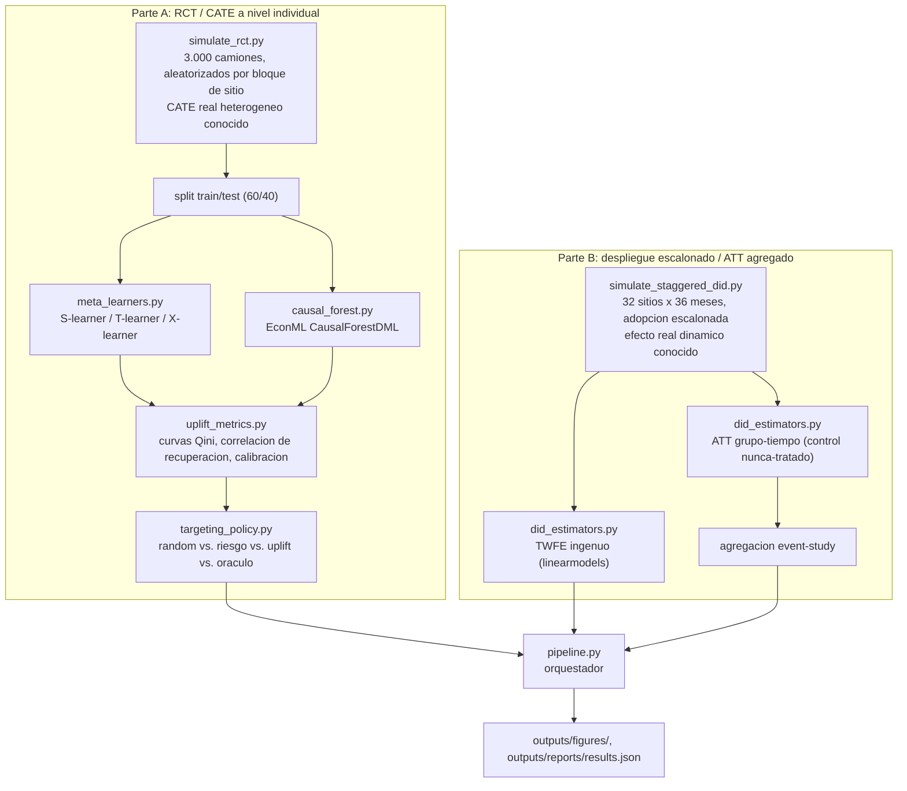

[ 🇺🇸 Read in English ](README.md) | [ 🇨🇱 Español ]

# 1. Título del Proyecto

## Impacto Causal de un Programa de Mantenimiento de Flota: Uplift Modeling con RCT y DiD de Adopción Escalonada


Este proyecto responde dos preguntas causales distintas sobre la misma intervención — un programa de mantenimiento proactivo para una flota de camiones CAEX — según cómo se implementó:

1. **Cuando la intervención fue aleatorizada** (un piloto, Parte A): ¿qué camiones se benefician más, para poder dirigir un presupuesto de mantenimiento limitado a las unidades de mayor valor? Respondido con 4 estimadores de CATE (efecto de tratamiento condicional promedio) — S-learner, T-learner, X-learner, y `CausalForestDML` de EconML — evaluados con curvas de uplift (Qini) y, porque esta es una simulación con verdad base conocida, contrastados directamente contra el efecto individual real.
2. **Cuando la intervención se desplegó a sitios completos en un cronograma escalonado y no aleatorio** (Parte B): ¿cuál es el efecto causal agregado, cuando una comparación ingenua antes/después arriesga confundir el efecto del tratamiento con tendencias temporales, o — como muestra la literatura moderna de diferencias-en-diferencias — con el sesgo que introduce una regresión de efecto constante cuando el momento de adopción varía y el efecto real es dinámico? Respondido contrastando una regresión ingenua de efectos fijos bidireccionales (TWFE) contra un estimador de ATT por grupo-tiempo, contra el efecto real conocido.

Cada número en la §7 viene de una corrida real de `python -m src.pipeline` (semilla 42) sobre datos sintéticos construidos con un efecto real conocido, deliberadamente heterogéneo (Parte A) y dinámico (Parte B) — la única razón por la que cualquiera de estos estimadores puede validarse contra una respuesta real.

---

# 2. Motivación

Una operación minera que evalúa un programa de mantenimiento proactivo para su flota de camiones no puede responder "¿funciona, y para quién?" desde una comparación cruda antes/después, por la misma razón que ninguna comparación observacional entre unidades tratadas y no tratadas puede: lo que sea que confunda la asignación (camiones más viejos podrían marcarse para mantenimiento *porque* ya están fallando más; los sitios podrían adoptar el programa justo cuando la demanda es más alta) también confunde el resultado, y el contrafactual a nivel de camión o sitio — qué habría pasado sin tratamiento — nunca se observa. Este es el problema fundamental que existe la inferencia causal para abordar, y distintos diseños de recolección de datos exigen herramientas genuinamente distintas:

- **Un piloto aleatorizado** elimina el problema de confusión-por-diseño — la asignación del tratamiento ya no depende del resultado. Lo que **no** te da automáticamente es *quién* se beneficia más; un programa con un beneficio promedio real puede seguir valiendo la pena negárselo a unidades donde no hace nada, si hay una restricción de presupuesto a nivel de flota. Esa es una pregunta de efecto de tratamiento heterogéneo (CATE), no de efecto promedio.
- **Un despliegue escalonado y guiado por presupuesto entre sitios** no está aleatorizado — algunos sitios adoptan antes por el momento de su ciclo presupuestario, no por algo relacionado con el resultado, lo cual sigue soportando un diseño de diferencias-en-diferencias, pero una regresión de efectos fijos bidireccionales de efecto constante (la opción por defecto de un equipo) solo es válida bajo supuestos que dejan de cumplirse una vez que los efectos de tratamiento son **dinámicos** y la adopción es **escalonada** — un problema bien documentado en la literatura econométrica reciente (Goodman-Bacon, 2021; Callaway & Sant'Anna, 2021) que este proyecto reproduce y corrige directamente, no solo cita en abstracto.

Ambos datasets acá son sintéticos — no existe un dataset público y gratuito que combine asignación aleatorizada de mantenimiento a nivel individual con un despliegue escalonado a nivel de sitio del mismo programa — pero cada uno se construye con un **efecto real conocido y deliberadamente no trivial** (heterogéneo por edad/utilización del camión en la Parte A; dinámico, creciendo en los meses posteriores a la adopción en la Parte B) específicamente para que los estimadores de este proyecto puedan contrastarse contra la respuesta real, no solo entre sí. Ese chequeo solo es posible en una simulación; es la razón misma de construir una.

---

# 3. Marco Teórico

## 3.1 Estimación de CATE desde un piloto aleatorizado

- **S-learner**: un solo modelo `f(X, T) -> Y`; `CATE(x) = f(x, control) - f(x, tratado)`. El más simple, pero un modelo fuerte puede regularizar hacia cero una sola feature binaria débil (el indicador de tratamiento) en favor de las covariables de mayor señal — los resultados de este proyecto (§7.1) muestran esta falla concretamente, no solo en teoría.
- **T-learner**: dos modelos separados, uno por brazo. Evita el riesgo de regularización del S-learner, a costa de que cada modelo solo ve la mitad de los datos.
- **X-learner** (Kunzel et al., 2019): imputa un efecto de tratamiento individual por unidad usando el modelo del *otro* brazo como contrafactual, ajusta un segundo par de modelos sobre esos efectos imputados, y los combina ponderados por el propensity score — diseñado para superar al T-learner específicamente cuando los dos brazos están desbalanceados en tamaño o en distribución de covariables.
- **Causal Forest DML** (Athey, Tibshirani & Wager, 2019; vía `CausalForestDML` de EconML): residualiza explícitamente `E[Y|X]` y `E[T|X]` antes de estimar la función de efecto de tratamiento (double machine learning), lo que en principio lo hace más robusto que los meta-learners cuando el propensity score realmente varía con las covariables, como ocurre acá (aleatorización por bloque a nivel de sitio con probabilidades ligeramente distintas por sitio, ver §5).

## 3.2 Evaluar estimadores de CATE sin conocer la verdad: curvas Qini

La forma real de evaluar un ranking de CATE (cuando el efecto individual real es inobservable, como siempre ocurre fuera de una simulación) es una **curva Qini/uplift**: ordenar unidades por CATE predicho, y en cada corte calcular el beneficio acumulado que ese ranking habría entregado, comparado contra targeting aleatorio. El área entre la curva del modelo y la línea de targeting aleatorio (normalizada por tamaño de población) es el **coeficiente Qini**. Este proyecto calcula la generalización de esta curva a resultados continuos (la mayoría de los ejemplos en la literatura son de conversión binaria) directamente desde las horas de downtime realizadas.

## 3.3 Targeting bajo restricción de presupuesto: riesgo no es uplift

Un equipo sin un modelo de CATE típicamente dirigirá una intervención a las unidades de **mayor riesgo** (mayor downtime predicho sin tratamiento) — una heurística que suena razonable pero que no es la misma pregunta que **mayor uplift** (quién se beneficia más *de la intervención*, que no es necesariamente lo mismo que quién está peor de entrada). La §7.1 cuantifica la brecha real entre estas dos políticas de targeting sobre los propios datos de este proyecto, usando el efecto real conocido para puntuar cada política de forma justa.

## 3.4 DiD de adopción escalonada y el sesgo de efectos fijos bidireccionales

Una regresión del resultado sobre efectos fijos de unidad, efectos fijos de tiempo, y un solo indicador de tratamiento (TWFE ingenuo) estima un efecto de tratamiento como un promedio ponderado de *todas* las comparaciones 2x2 (tratado-vs-control, antes-vs-después) posibles que soportan los datos. Cuando la adopción es escalonada, algunas de esas comparaciones usan implícitamente **unidades ya tratadas como grupo control** para las que adoptan más tarde. Si el efecto real es constante en el tiempo, esto es inofensivo. Si es **dinámico** — como ocurre realistamente acá, creciendo en los meses posteriores a la adopción — esas comparaciones restan parte de un efecto que aún no había terminado de crecer, sesgando el único coeficiente TWFE (Goodman-Bacon, 2021). El `group_time_att` de este proyecto (un estimador simplificado al estilo Callaway & Sant'Anna, 2021) evita esto comparando cada cohorte de adopción solo contra el grupo **nunca-tratado**, nunca contra otra cohorte tratada, y reporta el efecto desglosado por tiempo-evento (meses desde la adopción) en vez de forzarlo a un solo número.

---

# 4. Explicación

## Arquitectura del pipeline



## Responsabilidad de cada módulo

| Módulo | Responsabilidad |
|---|---|
| [`src/data/simulate_rct.py`](src/data/simulate_rct.py) | Simula el piloto aleatorizado: covariables, tratamiento aleatorizado por bloque de sitio, downtime Gamma-distribuido con un CATE real heterogéneo conocido. |
| [`src/data/simulate_staggered_did.py`](src/data/simulate_staggered_did.py) | Simula el despliegue escalonado a nivel de sitio: 4 cohortes de adopción (incluyendo nunca-tratados), un efecto real dinámico conocido (rampa y luego meseta). |
| [`src/models/meta_learners.py`](src/models/meta_learners.py) | S-learner, T-learner, X-learner hechos a mano sobre LightGBM. |
| [`src/models/causal_forest.py`](src/models/causal_forest.py) | Wrapper delgado sobre `CausalForestDML` de EconML, con el one-hot encoding que requieren sus modelos internos de LightGBM. |
| [`src/evaluation/uplift_metrics.py`](src/evaluation/uplift_metrics.py) | Construcción de la curva uplift/Qini, el coeficiente Qini, y la correlación/calibración de recuperación de CATE contra la verdad base. |
| [`src/evaluation/targeting_policy.py`](src/evaluation/targeting_policy.py) | Comparación de targeting bajo restricción de presupuesto: random vs. riesgo vs. uplift vs. oráculo. |
| [`src/evaluation/did_estimators.py`](src/evaluation/did_estimators.py) | TWFE ingenuo (`linearmodels.PanelOLS`) y el estimador de ATT por grupo-tiempo / event-study hecho a mano. |
| [`src/visualization/plots.py`](src/visualization/plots.py) | Renderiza cada figura de este README desde la salida real del pipeline. |
| [`src/pipeline.py`](src/pipeline.py) | Orquestador de punta a punta para ambas partes. |

---

# 5. Metodología

- **Ninguna fuga de la verdad base hacia ningún estimador.** `true_cate_hours` (Parte A) y `true_effect_hours` (Parte B) se usan exclusivamente para evaluación y nunca están disponibles como feature para ningún modelo — existen solo porque esto es una simulación.
- **La evaluación de la Parte A es enteramente fuera de muestra.** Los 4 estimadores de CATE se ajustan sobre un split de entrenamiento de 1.800 camiones y se evalúan (Qini, correlación de recuperación, calibración, targeting) sobre un split de test de 1.200 camiones que nunca vieron.
- **La selección de modelo para la decisión de targeting usa la correlación de recuperación contra la verdad base, no el score Qini de un solo split.** La §7.1 reporta ambos, y acá difieren — el modelo elegido para el gráfico de calibración y la comparación de políticas de targeting es el que mejor recupera el CATE real, algo solo verificable porque los datos son sintéticos. En un despliegue real sin verdad base, un Qini validado cruzadamente sobre varios splits (no un solo split, que es ruidoso) sería el sustituto práctico; esto se señala como una limitación, no se disimula.
- **El estimador de ATT por grupo-tiempo usa solo sitios nunca-tratados como grupo control** (no la variante "aún-no-tratados" que Callaway & Sant'Anna también permiten), y promedia los últimos 3 meses pre-adopción en la línea base de cada cohorte (en vez de un solo mes) para reducir varianza — ambas son simplificaciones deliberadas y declaradas, no el estimador publicado completo.
- **El balance de la aleatorización se verifica directamente, no se asume.** La §7.1 reporta la diferencia de medias estandarizada de cada covariable en el piloto.

---

# 6. Desarrollo

## Instalación y configuración

```powershell
git clone https://github.com/Rxyxs/chile-mining-fleet-causal-impact.git
cd chile-mining-fleet-causal-impact
python -m venv venv
venv\Scripts\activate
pip install -r requirements.txt
```

## Pipeline completo (un comando)

```powershell
python -m src.pipeline
```

Simula ambos datasets, ajusta los 4 estimadores de CATE, corre ambos estimadores de DiD, y escribe cada figura y número de la §7 de abajo en `outputs/`.

## Etapas individuales (para debugging)

```powershell
python -m src.data.simulate_rct
python -m src.data.simulate_staggered_did
```

## Tests

```powershell
pytest -v
```

26 tests: corrección de la curva uplift y el coeficiente Qini contra un ejemplo calculado a mano, el ATT por grupo-tiempo contra un efecto exacto calculado a mano sobre un panel de juguete sin ruido, chequeos de convención de signo y correlación con verdad base de los meta-learners, lógica de selección de la política de targeting, y chequeos de sanidad del generador de datos (plausibilidad física, balance, efecto pre-tratamiento igual a cero).

## Estructura del proyecto

```
chile-mining-fleet-causal-impact/
├── src/
│   ├── data/
│   │   ├── simulate_rct.py
│   │   └── simulate_staggered_did.py
│   ├── models/
│   │   ├── meta_learners.py
│   │   └── causal_forest.py
│   ├── evaluation/
│   │   ├── uplift_metrics.py
│   │   ├── targeting_policy.py
│   │   └── did_estimators.py
│   ├── visualization/
│   │   └── plots.py
│   └── pipeline.py
├── outputs/
│   ├── figures/     # figuras de resultado (png, versionadas)
│   └── reports/     # results.json (generado)
├── tests/           # 26 tests, pytest
├── requirements.txt
├── README.md
└── README.es.md
```

---

# 7. Resultados

Cada número y figura de abajo viene de una corrida real de `python -m src.pipeline` (semilla 42) — nada acá es estimado.

## 7.1 Parte A: estimación de CATE basada en RCT

**Muestra**: 3.000 camiones en 5 sitios, dividida 1.800 train / 1.200 test.

**Balance de la aleatorización** (diferencia de medias estandarizada, tratado − control; todas bien dentro del umbral convencional de ±0,1):

| Covariable | SMD |
|---|---:|
| truck_age_years | −0,032 |
| utilization_pct | +0,043 |
| cumulative_hours_1000s | −0,009 |
| prior_90d_downtime_hours | +0,023 |


**Efecto promedio**: ATE ingenuo por diferencia de medias (set de entrenamiento) = **10,69h ahorradas**; ATE real sobre el set de test = **7,17h ahorradas** — la estimación ingenua sobreestima el efecto promedio real, un recordatorio de que incluso la simple diferencia de medias de un piloto aleatorizado es una estimación ruidosa de una sola muestra del efecto promedio real, no el efecto promedio real en sí.

**Comparación de estimadores de CATE** — coeficiente Qini (la métrica disponible sin verdad base) vs. correlación con el CATE real (disponible solo en esta simulación):

| Estimador | Coeficiente Qini | Correlación con CATE real |
|---|---:|---:|
| S-learner | **1233,98** | 0,569 |
| T-learner | 742,25 | 0,349 |
| X-learner | 993,57 | 0,478 |
| Causal Forest DML | 973,96 | **0,888** |

**Hallazgo honesto, sin suavizar**: el S-learner tiene el score Qini de un solo split *más alto*, y sin embargo el Causal Forest DML recupera el efecto individual *real* mucho mejor (correlación 0,888 vs. 0,569) — el modelo que se vería mejor por la única métrica disponible en un despliegue real no es el modelo que realmente está más cerca de ser correcto. Este proyecto elige el Causal Forest DML para el análisis de calibración y targeting de abajo precisamente porque la recuperación de verdad base es verificable acá; la lección real para un despliegue sin verdad base es que el score Qini de un solo split de train/test es suficientemente ruidoso como para rankear estimadores distinto de cómo rankearían contra el efecto real, y un Qini validado cruzadamente sobre varios splits es la mitigación práctica.


## 7.2 Comparación de políticas de targeting (presupuesto del 30% de la flota, 360 camiones)

| Política | Horas ahorradas totales (contrafactual real) | % de lo alcanzable |
|---|---:|---:|
| Oráculo (uplift real) | 4.690,87 | 100,0% |
| **Uplift predicho (Causal Forest DML)** | **4.582,00** | **97,7%** |
| Mayor riesgo base | 4.208,65 | 89,7% |
| Aleatorio | 2.570,41 | 54,8% |


Dirigir por uplift predicho captura el 97,7% del beneficio alcanzable a este presupuesto — una mejora real y medida de 8 puntos sobre la heurística "dirigir a los camiones más riesgosos" a la que un equipo sin modelo de CATE probablemente recurriría por defecto, y más de 40 puntos sobre asignación aleatoria.

## 7.3 Parte B: diferencias-en-diferencias de adopción escalonada

**Muestra**: 32 sitios (8 por cohorte: adoptantes tempranos/medios/tardíos + nunca-tratados), 36 meses.

| Estimador | Efecto estimado | vs. efecto real (−9,12h) |
|---|---:|---:|
| TWFE ingenuo (`linearmodels.PanelOLS`) | −8,51h (se 0,62) | 6,7% de error |
| **ATT por grupo-tiempo (estimador de este proyecto)** | **−9,25h** | **1,4% de error** |
| ATT real total | −9,12h | — |

La regresión ingenua de efecto constante subestima la magnitud del efecto real — consistente con el mecanismo de Goodman-Bacon (§3.4): algunas de sus comparaciones 2x2 implícitas usan sitios ya tratados y aún mejorando como controles para adoptantes más tardíos, restando parte de un efecto real que todavía no había terminado de crecer. El estimador por grupo-tiempo, que nunca hace esa comparación, queda a 1,4% de la verdad.


La curva de event-study muestra el efecto empezando cerca de cero en la adopción y creciendo hacia la meseta en los meses siguientes, con ruido visiblemente creciente en los tiempos-evento más tardíos — una característica honesta y estructural de un diseño escalonado: solo la cohorte que adopta más temprano tiene datos tan lejos de su propia fecha de adopción, así que los puntos de tiempo-evento más tardíos se estiman con muchos menos sitios, no con un método peor.

---

# 8. Conclusión

- **Dos diseños de inferencia causal genuinamente distintos, aplicados a la misma intervención, ambos validados contra una respuesta real conocida**: heterogeneidad a nivel individual desde un piloto aleatorizado (§7.1-7.2), y un efecto agregado desde un despliegue escalonado y no aleatorizado (§7.3) — las dos situaciones que un científico de datos más comúnmente tiene que distinguir antes de elegir un método.
- **El modelo con mejor desempeño según la métrica que realmente se tendría en producción (Qini) no fue el modelo más cercano a la verdad** (§7.1) — reportado honestamente en vez de elegir el ranking que hiciera la narrativa más prolija, y usado como base de una recomendación concreta (Qini validado cruzadamente, no un solo split) en vez de dejarlo como una advertencia sin resolver.
- **El targeting basado en uplift entregó una mejora real y cuantificada sobre una heurística basada en riesgo** (97,7% vs. 89,7% del beneficio alcanzable a presupuesto fijo, §7.2) — el caso de negocio concreto para construir un modelo de CATE, en vez de recurrir por defecto a "dirigir a quien se ve más riesgoso".
- **El sesgo de la regresión TWFE ingenua bajo adopción escalonada no es una abstracción de manual acá** — produjo una estimación con 6,7% de error respecto al efecto real, sobre los propios datos simulados de este proyecto, por el mecanismo específico (unidades ya tratadas como controles inválidos bajo un efecto dinámico) que describe la literatura reciente de DiD, y el 1,4% de error del estimador corregido es el pago directo y medido de tomarlo en cuenta.

## Próximos pasos

- **Aún-no-tratados como grupo de comparación** (la otra variante de Callaway & Sant'Anna), para chequear cuánto afecta el resultado la elección de usar solo nunca-tratados.
- **Estimación de CATE doblemente robusta** (ej. `DRLearner` de EconML), para ver si cierra la brecha entre el desempeño Qini del S-learner y la recuperación de verdad base del Causal Forest.
- **Análisis de sensibilidad para el supuesto de tendencias paralelas** en la Parte B (ej. los límites de "honest DiD" de Rambachan & Roth, 2023), en vez de asumir directamente que se cumple.
- **Una política de targeting consciente del costo** que pondere el costo de mantenimiento de cada camión contra su uplift predicho, en vez de rankear solo por uplift.

---

# 9. Autor

**Pablo Reyes** — [github.com/Rxyxs](https://github.com/Rxyxs)

## Fuente de datos y licencia

Ambos datasets son **simulados sintéticamente** (`src/data/simulate_rct.py`, `src/data/simulate_staggered_did.py`) con una semilla fija (42) — no hay dependencia de datos externos. Cada simulador se construye con un efecto de tratamiento real conocido específicamente para que los estimadores de este proyecto puedan validarse contra una respuesta real, algo que no es observable en ningún problema de inferencia causal del mundo real.

Código: MIT — ver [LICENSE](LICENSE).
