[ 🇺🇸 Read in English ](README.md) | [ 🇨🇱 Español ]

# 1. Título del Proyecto

## Impacto Causal de un Programa de Mantenimiento de Flota: Uplift Modeling con RCT y DiD de Adopción Escalonada


Este proyecto responde dos preguntas causales distintas sobre la misma intervención — un programa de mantenimiento proactivo para una flota de camiones CAEX — según cómo se implementó:

1. **Cuando la intervención fue aleatorizada** (un piloto, Parte A): ¿qué camiones se benefician más, para poder dirigir un presupuesto de mantenimiento limitado a las unidades de mayor valor? Respondido con 5 estimadores de CATE (efecto de tratamiento condicional promedio) — S-learner, T-learner, X-learner, `CausalForestDML` de EconML, y `DRLearner` de EconML (doblemente robusto) — evaluados con curvas de uplift (Qini) y, porque esta es una simulación con verdad base conocida, contrastados directamente contra el efecto individual real.
2. **Cuando la intervención se desplegó a sitios completos en un cronograma escalonado y no aleatorio** (Parte B): ¿cuál es el efecto causal agregado, cuando una comparación ingenua antes/después arriesga confundir el efecto del tratamiento con tendencias temporales, o — como muestra la literatura moderna de diferencias-en-diferencias — con el sesgo que introduce una regresión de efecto constante cuando el momento de adopción varía y el efecto real es dinámico? Respondido contrastando una regresión ingenua de efectos fijos bidireccionales (TWFE) contra un estimador de ATT por grupo-tiempo, contra el efecto real conocido — y luego preguntando cuánto depende realmente esa conclusión de que se cumpla el supuesto de tendencias paralelas, vía un análisis de sensibilidad dedicado.

Cada número en las §7.1-7.5 viene de una corrida real de `python -m src.pipeline` (semilla 42) sobre datos sintéticos construidos con un efecto real conocido, deliberadamente heterogéneo (Parte A) y dinámico (Parte B) — la única razón por la que cualquiera de estos estimadores puede validarse contra una respuesta real. La §7.6 vuelve a correr los estimadores de la Parte A sobre 20 semillas con covariables reales de sensores (Scania APS, AI4I 2020), con un tratamiento simulado y un efecto conocido. `02_Double_Robust_CATE_Analysis.ipynb` es un notebook complementario, completamente ejecutado, que contrasta el estimador doblemente robusto contra un efecto ingenuo único para todos, sobre los mismos datos de la Parte A.

**Validación con datos reales (§7.7).** Una simulación puede puntuar un estimador contra el efecto verdadero porque ella misma lo escribió; los datos reales nunca ofrecen eso. Por eso la §7.7 corre los mismos estimadores sobre dos datasets públicos *reales* que no tienen nada que ver con minería y comprueba lo que sí se puede comprobar ahí: que el DiD de adopción escalonada coincide con una implementación independiente, y que los rankings de CATE se sostienen en un ensayo aleatorizado genuino.

---

# 2. Motivación

Una operación minera que evalúa un programa de mantenimiento proactivo para su flota de camiones no puede responder "¿funciona, y para quién?" desde una comparación cruda antes/después, por la misma razón que ninguna comparación observacional entre unidades tratadas y no tratadas puede: lo que sea que confunda la asignación (camiones más viejos podrían marcarse para mantenimiento *porque* ya están fallando más; los sitios podrían adoptar el programa justo cuando la demanda es más alta) también confunde el resultado, y el contrafactual a nivel de camión o sitio — qué habría pasado sin tratamiento — nunca se observa. Este es el problema fundamental que existe la inferencia causal para abordar, y distintos diseños de recolección de datos exigen herramientas genuinamente distintas:

- **Un piloto aleatorizado** elimina el problema de confusión-por-diseño — la asignación del tratamiento ya no depende del resultado. Lo que **no** te da automáticamente es *quién* se beneficia más; un programa con un beneficio promedio real puede seguir valiendo la pena negárselo a unidades donde no hace nada, si hay una restricción de presupuesto a nivel de flota. Esa es una pregunta de efecto de tratamiento heterogéneo (CATE), no de efecto promedio.
- **Un despliegue escalonado y guiado por presupuesto entre sitios** no está aleatorizado — algunos sitios adoptan antes por el momento de su ciclo presupuestario, no por algo relacionado con el resultado, lo cual sigue soportando un diseño de diferencias-en-diferencias, pero una regresión de efectos fijos bidireccionales de efecto constante (la opción por defecto de un equipo) solo es válida bajo supuestos que dejan de cumplirse una vez que los efectos de tratamiento son **dinámicos** y la adopción es **escalonada** — un problema bien documentado en la literatura econométrica reciente (Goodman-Bacon, 2021; Callaway & Sant'Anna, 2021) que este proyecto reproduce y corrige directamente, no solo cita en abstracto.

Ambos datasets acá son sintéticos — no existe un dataset público y gratuito que combine asignación aleatorizada de mantenimiento a nivel individual con un despliegue escalonado a nivel de sitio del mismo programa — pero cada uno se construye con un **efecto real conocido y deliberadamente no trivial** (heterogéneo por edad/utilización del camión en la Parte A; dinámico, creciendo en los meses posteriores a la adopción en la Parte B) específicamente para que los estimadores de este proyecto puedan contrastarse contra la respuesta real, no solo entre sí. Ese chequeo solo es posible en una simulación; es la razón misma de construir una.

## 2.1 Impacto de Negocio e Indicadores Clave (KPIs)

| Métrica | Resultado | Qué significa |
|---|---|---|
| Mejor estimador CATE vs. verdad conocida | Causal Forest DML, correlación 0,888 (semilla 42, un solo split) | Mayor recuperación del efecto real, aunque el DRLearner obtuvo mejor Qini (la única métrica disponible sin verdad conocida). En 20 semillas las medias son 0,813 (Causal Forest) y 0,718 (DRLearner), así que el split único queda del lado optimista (§7.6) |
| Valor de política de targeting capturado | **97,7%** del beneficio alcanzable por el oráculo | vs. 89,7% de "priorizar camiones de mayor riesgo" y 54,8% aleatorio, a presupuesto fijo del 30% de la flota |
| Precisión del DiD de adopción escalonada | Group-time ATT: 1,4% de error vs. efecto real | vs. 6,7% de error de efectos fijos bidireccionales naive, que subestima el efecto real por el mecanismo de sesgo Goodman-Bacon |
| Bug real de estimador detectado y corregido | DRLearner con 19,75% de predicciones de signo incorrecto → corregido | Causa raíz: un learner de etapa final sobreajustado sobre un pseudo-resultado ruidoso; correlación con la verdad pasó de 0,38 a 0,80 |
| Balance de aleatorización | Todas las covariables dentro de ±0,1 SMD | Confirma que la asignación de tratamiento del piloto RCT es genuinamente independiente de las características pre-tratamiento |
| Prueba de estrés con sensores reales (Scania APS, 20 semillas) | El DRLearner por defecto colapsa (r = −0,01); una etapa final Ridge con log selectivo lo recupera a 0,61–0,79 | Con covariables reales de sensores, de cola pesada y colineales, Causal Forest sigue liderando en recuperación del CATE (+0,065 a +0,094, IC 95% sin el 0), pero su ventaja en valor de focalización no es significativa (§7.6) |

---

# 3. Marco Teórico

## 3.1 Estimación de CATE desde un piloto aleatorizado

- **S-learner**: un solo modelo `f(X, T) -> Y`; `CATE(x) = f(x, control) - f(x, tratado)`. El más simple, pero un modelo fuerte puede regularizar hacia cero una sola feature binaria débil (el indicador de tratamiento) en favor de las covariables de mayor señal — los resultados de este proyecto (§7.1) muestran esta falla concretamente, no solo en teoría.
- **T-learner**: dos modelos separados, uno por brazo. Evita el riesgo de regularización del S-learner, a costa de que cada modelo solo ve la mitad de los datos.
- **X-learner** (Kunzel et al., 2019): imputa un efecto de tratamiento individual por unidad usando el modelo del *otro* brazo como contrafactual, ajusta un segundo par de modelos sobre esos efectos imputados, y los combina ponderados por el propensity score — diseñado para superar al T-learner específicamente cuando los dos brazos están desbalanceados en tamaño o en distribución de covariables.
- **Causal Forest DML** (Athey, Tibshirani & Wager, 2019; vía `CausalForestDML` de EconML): residualiza explícitamente `E[Y|X]` y `E[T|X]` antes de estimar la función de efecto de tratamiento (double machine learning), lo que en principio lo hace más robusto que los meta-learners cuando el propensity score realmente varía con las covariables, como ocurre acá (aleatorización por bloque a nivel de sitio con probabilidades ligeramente distintas por sitio, ver §5).
- **Doubly Robust Learner** (vía `DRLearner` de EconML): construye un pseudo-resultado por unidad, ponderado por el inverso del propensity score aumentado (AIPW), y luego ajusta un modelo final sobre él. "Doblemente robusto" significa que la estimación se mantiene consistente si *cualquiera* de los dos modelos (propensity u outcome) está correctamente especificado — no ambos — una cobertura real contra especificar mal uno de los dos modelos de nuisance. La §5 documenta una inestabilidad real de muestra finita encontrada al construir este estimador, y cómo se corrigió.

## 3.2 Evaluar estimadores de CATE sin conocer la verdad: curvas Qini

La forma real de evaluar un ranking de CATE (cuando el efecto individual real es inobservable, como siempre ocurre fuera de una simulación) es una **curva Qini/uplift**: ordenar unidades por CATE predicho, y en cada corte calcular el beneficio acumulado que ese ranking habría entregado, comparado contra targeting aleatorio. El área entre la curva del modelo y la línea de targeting aleatorio (normalizada por tamaño de población) es el **coeficiente Qini**. Este proyecto calcula la generalización de esta curva a resultados continuos (la mayoría de los ejemplos en la literatura son de conversión binaria) directamente desde las horas de downtime realizadas.

## 3.3 Targeting bajo restricción de presupuesto: riesgo no es uplift

Un equipo sin un modelo de CATE típicamente dirigirá una intervención a las unidades de **mayor riesgo** (mayor downtime predicho sin tratamiento) — una heurística que suena razonable pero que no es la misma pregunta que **mayor uplift** (quién se beneficia más *de la intervención*, que no es necesariamente lo mismo que quién está peor de entrada). La §7.1 cuantifica la brecha real entre estas dos políticas de targeting sobre los propios datos de este proyecto, usando el efecto real conocido para puntuar cada política de forma justa.

## 3.4 DiD de adopción escalonada y el sesgo de efectos fijos bidireccionales

Una regresión del resultado sobre efectos fijos de unidad, efectos fijos de tiempo, y un solo indicador de tratamiento (TWFE ingenuo) estima un efecto de tratamiento como un promedio ponderado de *todas* las comparaciones 2x2 (tratado-vs-control, antes-vs-después) posibles que soportan los datos. Cuando la adopción es escalonada, algunas de esas comparaciones usan implícitamente **unidades ya tratadas como grupo control** para las que adoptan más tarde. Si el efecto real es constante en el tiempo, esto es inofensivo. Si es **dinámico** — como ocurre realistamente acá, creciendo en los meses posteriores a la adopción — esas comparaciones restan parte de un efecto que aún no había terminado de crecer, sesgando el único coeficiente TWFE (Goodman-Bacon, 2021). El `group_time_att` de este proyecto (un estimador simplificado al estilo Callaway & Sant'Anna, 2021) evita esto comparando cada cohorte de adopción solo contra el grupo **nunca-tratado**, nunca contra otra cohorte tratada, y reporta el efecto desglosado por tiempo-evento (meses desde la adopción) en vez de forzarlo a un solo número.

## 3.5 Estimación doblemente robusta, y por qué importa su etapa final

El pseudo-resultado AIPW de un estimador doblemente robusto divide por el propensity score estimado, lo que significa que una unidad cerca del límite de recorte (trimming) del propensity puede aportar un término de corrección grande y ruidoso a lo que la etapa final regresiona. Un modelo final flexible (ej. LightGBM) puede sobreajustar ese ruido; una etapa final más simple lo regulariza. La §5 y la §7.1 reportan la diferencia real y medida que esto produjo sobre los propios datos de este proyecto — no una preocupación hipotética.

## 3.6 Análisis de sensibilidad: ¿cuánto depende la conclusión de las tendencias paralelas?

El estimador de ATT por grupo-tiempo (§3.4) solo es insesgado si el supuesto de tendencias paralelas realmente se cumple — que los sitios tratados y nunca-tratados se habrían movido juntos en ausencia de tratamiento. Ese supuesto nunca es directamente verificable (es una afirmación sobre un contrafactual), pero puede *ponerse a prueba* de tres formas, en orden creciente de cuánto asumen: (1) una **prueba placebo de pre-tendencia** — repetir la misma comparación 2x2 enteramente dentro de la ventana pre-tratamiento, donde no pasó nada, y verificar que el "efecto" salga cerca de cero; (2) **límites honestos** (una versión simplificada de la restricción de "magnitudes relativas" de Rambachan & Roth, 2023) — asumir que una violación post-tratamiento no detectada podría ser hasta `M` veces la mayor desviación de pre-tendencia realmente observada, y encontrar el `M` más pequeño (el "valor de quiebre") en el que la conclusión ya no descartaría un efecto cero; (3) un **barrido de inyección empírica** — inyectar de verdad una violación sintética de tamaño conocido y re-estimar, para medir (no solo acotar) cuánto movería una violación de ese tamaño al propio estimador de este proyecto. La §7.4 reporta los tres, corridos de verdad.

---

# 4. Explicación

## Arquitectura del pipeline

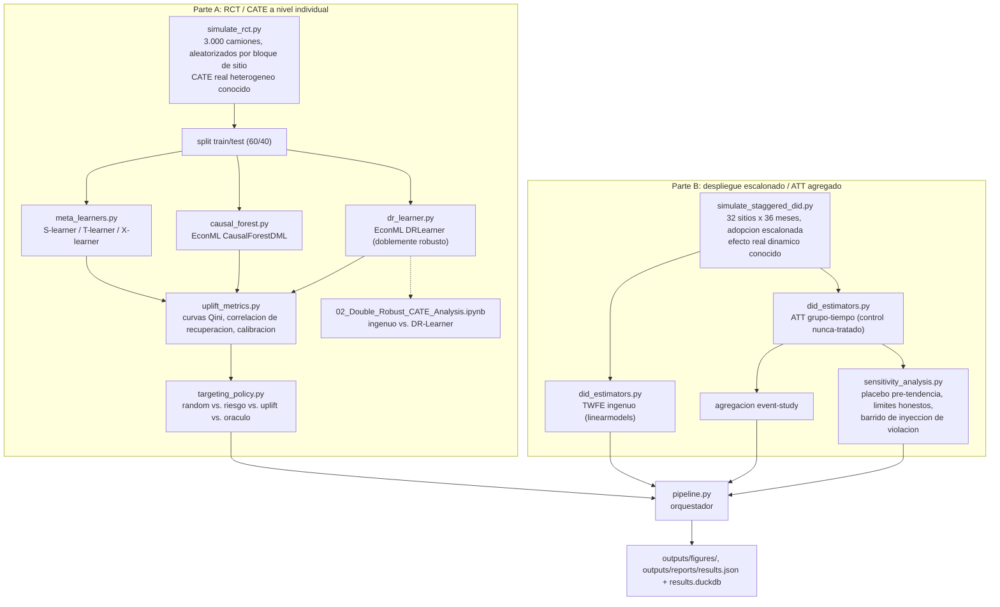
```mermaid
flowchart TB
    subgraph A["Parte A: RCT / CATE a nivel individual"]
        A1["simulate_rct.py<br/>3.000 camiones, aleatorizados por bloque de sitio<br/>CATE real heterogeneo conocido"] --> A2["split train/test (60/40)"]
        A2 --> A3["meta_learners.py<br/>S-learner / T-learner / X-learner"]
        A2 --> A4["causal_forest.py<br/>EconML CausalForestDML"]
        A2 --> A4b["dr_learner.py<br/>EconML DRLearner (doblemente robusto)"]
        A3 --> A5["uplift_metrics.py<br/>curvas Qini, correlacion de recuperacion, calibracion"]
        A4 --> A5
        A4b --> A5
        A5 --> A6["targeting_policy.py<br/>random vs. riesgo vs. uplift vs. oraculo"]
        A4b -.-> NB["02_Double_Robust_CATE_Analysis.ipynb<br/>ingenuo vs. DR-Learner"]
    end

    subgraph B["Parte B: despliegue escalonado / ATT agregado"]
        B1["simulate_staggered_did.py<br/>32 sitios x 36 meses, adopcion escalonada<br/>efecto real dinamico conocido"] --> B2["did_estimators.py<br/>TWFE ingenuo (linearmodels)"]
        B1 --> B3["did_estimators.py<br/>ATT grupo-tiempo (control nunca-tratado)"]
        B3 --> B4["agregacion event-study"]
        B3 --> B5["sensitivity_analysis.py<br/>placebo pre-tendencia, limites honestos,<br/>barrido de inyeccion de violacion"]
    end

    A6 --> P["pipeline.py<br/>orquestador"]
    B2 --> P
    B4 --> P
    B5 --> P
    P --> O["outputs/figures/, outputs/reports/results.json + results.duckdb"]
```

## Responsabilidad de cada módulo

| Módulo | Responsabilidad |
|---|---|
| [`src/data/simulate_rct.py`](src/data/simulate_rct.py) | Simula el piloto aleatorizado: covariables, tratamiento aleatorizado por bloque de sitio, downtime Gamma-distribuido con un CATE real heterogéneo conocido. |
| [`src/data/simulate_staggered_did.py`](src/data/simulate_staggered_did.py) | Simula el despliegue escalonado a nivel de sitio: 4 cohortes de adopción (incluyendo nunca-tratados), un efecto real dinámico conocido (rampa y luego meseta). |
| [`src/models/meta_learners.py`](src/models/meta_learners.py) | S-learner, T-learner, X-learner hechos a mano sobre LightGBM. |
| [`src/models/causal_forest.py`](src/models/causal_forest.py) | Wrapper delgado sobre `CausalForestDML` de EconML, con el one-hot encoding que requieren sus modelos internos de LightGBM. |
| [`src/models/dr_learner.py`](src/models/dr_learner.py) | Wrapper delgado sobre `DRLearner` de EconML, con el mismo one-hot encoding y una corrección de estabilidad de la etapa final documentada (§3.5, §7.1). |
| [`src/evaluation/uplift_metrics.py`](src/evaluation/uplift_metrics.py) | Construcción de la curva uplift/Qini, el coeficiente Qini, y la correlación/calibración de recuperación de CATE contra la verdad base. |
| [`src/evaluation/targeting_policy.py`](src/evaluation/targeting_policy.py) | Comparación de targeting bajo restricción de presupuesto: random vs. riesgo vs. uplift vs. oráculo. |
| [`src/evaluation/did_estimators.py`](src/evaluation/did_estimators.py) | TWFE ingenuo (`linearmodels.PanelOLS`) y el estimador de ATT por grupo-tiempo / event-study hecho a mano. |
| [`src/evaluation/sensitivity_analysis.py`](src/evaluation/sensitivity_analysis.py) | Prueba placebo de pre-tendencia, límites honestos/valor de quiebre, y el barrido de inyección de violación empírica (§3.6, §7.4). |
| [`src/evaluation/results_db.py`](src/evaluation/results_db.py) | Persiste las tablas de comparación de §7.1-7.3 en una base de datos DuckDB local consultable (§7.5). |
| [`src/visualization/plots.py`](src/visualization/plots.py) | Renderiza cada figura estática de este README desde la salida real del pipeline. |
| [`src/visualization/interactive_plots.py`](src/visualization/interactive_plots.py) | Renderiza el gráfico interactivo Plotly de CATE predicho vs. real (§7.1) desde el mismo ajuste semilla-42 de la Parte A. |
| [`src/pipeline.py`](src/pipeline.py) | Orquestador de punta a punta para ambas partes. |
| [`src/data/download_real_data.py`](src/data/download_real_data.py) | Descarga los datasets Scania APS y AI4I 2020 desde UCI a `data/raw/` (§7.6). |
| [`src/data/semi_synthetic_dgp.py`](src/data/semi_synthetic_dgp.py) | Piloto semi-sintético sobre covariables reales: tratamiento aleatorizado por bloques y un efecto heterogéneo conocido que depende de columnas reales de desgaste y estrés; opcionalmente, las fallas reales del dataset entran en Y0. |
| [`src/pipeline_real_data.py`](src/pipeline_real_data.py) | Benchmark semi-sintético: los 5 estimadores de la Parte A en 5 condiciones x 20 semillas, con métricas de recuperación, Qini y focalización independientes de la escala. |
| [`src/pipeline_dr_ablation.py`](src/pipeline_dr_ablation.py) | Ablación de la etapa final del DRLearner (OLS / log / Ridge / Ridge con log selectivo / LightGBM) que aísla por qué colapsa en Scania. |
| [`src/data/real_data.py`](src/data/real_data.py) | Descarga y adapta los dos datasets reales de §7.7 (`mpdta`, Hillstrom). |
| [`src/pipeline_real_did.py`](src/pipeline_real_did.py) | Parte B sobre `mpdta`: el ATT por grupo-tiempo de este proyecto contra la referencia `csdid`, agregado ponderado por cohorte y bootstrap por conglomerados. |
| [`src/pipeline_real_rct.py`](src/pipeline_real_rct.py) | Parte A sobre el ensayo de Hillstrom: 5 estimadores x 2 campañas x 20 particiones, Qini con p-valores de permutación y efecto de focalización del 30% superior. |
| [`src/evaluation/semi_synthetic_diagnostics.py`](src/evaluation/semi_synthetic_diagnostics.py) | Dificultad de la verdad base por dataset: fracción de la varianza del CATE que viene de fallas reales, techo de correlación alcanzable, asimetría, faltantes y colinealidad. |
| [`src/visualization/semi_synthetic_plots.py`](src/visualization/semi_synthetic_plots.py) | Curvas Qini por condición y distribución de métricas por semilla del benchmark semi-sintético. |
| [`02_Double_Robust_CATE_Analysis.ipynb`](02_Double_Robust_CATE_Analysis.ipynb) | Notebook complementario, completamente ejecutado: efecto ingenuo único para todos vs. `DoublyRobustModel` sobre datos de la Parte A, con gráficos comparativos. |

---

# 5. Metodología

- **Ninguna fuga de la verdad base hacia ningún estimador.** `true_cate_hours` (Parte A) y `true_effect_hours` (Parte B) se usan exclusivamente para evaluación y nunca están disponibles como feature para ningún modelo — existen solo porque esto es una simulación.
- **La evaluación de la Parte A es enteramente fuera de muestra.** Los 5 estimadores de CATE se ajustan sobre un split de entrenamiento de 1.800 camiones y se evalúan (Qini, correlación de recuperación, calibración, targeting) sobre un split de test de 1.200 camiones que nunca vieron.
- **La selección de modelo para la decisión de targeting usa la correlación de recuperación contra la verdad base, no el score Qini de un solo split.** La §7.1 reporta ambos, y acá difieren — el modelo elegido para el gráfico de calibración y la comparación de políticas de targeting es el que mejor recupera el CATE real, algo solo verificable porque los datos son sintéticos. En un despliegue real sin verdad base, un Qini validado cruzadamente sobre varios splits (no un solo split, que es ruidoso) sería el sustituto práctico; esto se señala como una limitación, no se disimula.
- **La etapa final del `DRLearner` es una regresión lineal simple, no LightGBM.** Una primera versión usó una etapa final flexible de LightGBM (igualando la flexibilidad de `CausalForestModel`) y `min_propensity=0.05`; resultó empíricamente inestable (19,75% de las predicciones en test tenían el signo equivocado, rango predicho de −75h a +185h contra un rango real de 0,5h-39h). Cambiar la etapa final al default documentado por EconML (lineal) y subir `min_propensity` a 0,1 lo corrigió — la correlación con el CATE real pasó de 0,38 a 0,80. Esto se reporta como un hallazgo real y medido (§7.1), no un detalle de tuning escondido. Esa corrección se validó solo sobre features sintéticas bien comportadas: con las covariables reales de sensores de Scania, de cola pesada, la misma etapa final OLS colapsa, y hace falta en su lugar una etapa final Ridge con log1p sobre las columnas asimétricas (§7.6).
- **El estimador de ATT por grupo-tiempo usa solo sitios nunca-tratados como grupo control** (no la variante "aún-no-tratados" que Callaway & Sant'Anna también permiten), y promedia los últimos 3 meses pre-adopción en la línea base de cada cohorte (en vez de un solo mes) para reducir varianza — ambas son simplificaciones deliberadas y declaradas, no el estimador publicado completo.
- **Los "límites honestos" del análisis de sensibilidad son una versión simplificada y hecha a mano de Rambachan & Roth (2023)**, no el paquete publicado `HonestDiD` — la idea de "magnitudes relativas" (acotar la violación plausible por un múltiplo de la mayor desviación de pre-tendencia observada) se implementa directamente; clases de restricción más elaboradas (suavidad, signo) del mismo paper no.
- **El balance de la aleatorización se verifica directamente, no se asume.** La §7.1 reporta la diferencia de medias estandarizada de cada covariable en el piloto.

---

# 6. Desarrollo

## Instalación y configuración

```powershell
git clone https://github.com/Rxyxs/chile-mining-fleet-causal-impact.git
cd chile-mining-fleet-causal-impact
python -m venv venv
venv\Scripts\activate
pip install -r requirements.txt
```

## Pipeline completo (un comando)

```powershell
python -m src.pipeline
```

Simula ambos datasets, ajusta los 5 estimadores de CATE, corre ambos estimadores de DiD más el análisis de sensibilidad, y escribe cada figura y número de la §7 de abajo en `outputs/`.

## Gráfico interactivo (opcional)

```powershell
python -m src.visualization.interactive_plots
```

Reajusta los 5 estimadores de la Parte A sobre el mismo split semilla-42 y escribe el HTML interactivo autocontenido de la §7.1 en `outputs/interactive/cate_estimator_comparison.html`. No forma parte de la corrida principal del pipeline de arriba (que solo genera matplotlib/PNG), ya que duplica el ajuste de la Parte A en vez de reusar un modelo ya ajustado en memoria.

## Etapas individuales (para debugging)

```powershell
python -m src.data.simulate_rct
python -m src.data.simulate_staggered_did
```

## Notebook complementario

```powershell
jupyter nbconvert --to notebook --execute --inplace 02_Double_Robust_CATE_Analysis.ipynb
# o abrirlo interactivamente:
jupyter notebook 02_Double_Robust_CATE_Analysis.ipynb
```

Efecto ingenuo único para todos vs. el CATE por camión de `DoublyRobustModel`, sobre los mismos datos de la Parte A, con gráficos comparativos (la §7.1 tiene los números a nivel de pipeline; este notebook tiene los individuales).

## Tests

```powershell
pytest -v
```

61 tests: corrección de la curva uplift y el coeficiente Qini contra un ejemplo calculado a mano, el ATT por grupo-tiempo contra un efecto exacto calculado a mano sobre un panel de juguete sin ruido, chequeos de convención de signo y correlación con verdad base de los meta-learners y el DR-learner, lógica de selección de la política de targeting, chequeos de sanidad del generador de datos (plausibilidad física, balance, efecto pre-tratamiento igual a cero), y el módulo de análisis de sensibilidad (detección de placebo de pre-tendencia, valor de quiebre de límites honestos, y el barrido de inyección de violación) contra valores exactos calculados a mano sobre paneles de juguete deterministas, y el round-trip del almacén de comparación DuckDB en `results_db.py`, y el DGP semi-sintético de `semi_synthetic_dgp.py` (proporción exacta de tratados por bloque, CATE verdadero igual a la brecha entre las medias de los brazos, resultados estrictamente positivos sin recorte, fallas reales que entran a la verdad solo cuando se activan, valores faltantes que pasan intactos y reproducibilidad por semilla).

## Estructura del proyecto

```
chile-mining-fleet-causal-impact/
├── src/
│   ├── data/
│   │   ├── simulate_rct.py
│   │   ├── simulate_staggered_did.py
│   │   ├── download_real_data.py
│   │   ├── semi_synthetic_dgp.py
│   │   └── real_data.py
│   ├── models/
│   │   ├── meta_learners.py
│   │   ├── causal_forest.py
│   │   └── dr_learner.py
│   ├── evaluation/
│   │   ├── uplift_metrics.py
│   │   ├── targeting_policy.py
│   │   ├── did_estimators.py
│   │   ├── sensitivity_analysis.py
│   │   ├── results_db.py
│   │   └── semi_synthetic_diagnostics.py
│   ├── visualization/
│   │   ├── plots.py
│   │   ├── interactive_plots.py
│   │   └── semi_synthetic_plots.py
│   ├── pipeline.py
│   ├── pipeline_real_data.py      # benchmark semi-sintético (§7.6)
│   ├── pipeline_dr_ablation.py    # ablación de la etapa final del DRLearner (§7.6)
│   ├── pipeline_real_did.py       # Parte B con datos reales, mpdta (§7.7)
│   └── pipeline_real_rct.py       # Parte A en un ensayo aleatorizado real, Hillstrom (§7.7)
├── 02_Double_Robust_CATE_Analysis.ipynb    # ejecutado, salidas reales
├── data/raw/          # datos simulados y descargados de UCI (generados, ignorados por git)
├── outputs/
│   ├── figures/       # figuras de resultado (png/gif, versionadas)
│   ├── interactive/   # HTML interactivo Plotly (generado, ignorado por git)
│   └── reports/       # results.json, results.duckdb, CSVs semi-sintéticos (generados);
│                      # semi_synthetic_results.md (versionado)
├── tests/           # 61 tests, pytest
├── requirements.txt
├── README.md
└── README.es.md
```

---

# 7. Resultados

Cada número y figura de abajo viene de una corrida real de `python -m src.pipeline` (semilla 42) — nada acá es estimado.

## 7.1 Parte A: estimación de CATE basada en RCT

**Muestra**: 3.000 camiones en 5 sitios, dividida 1.800 train / 1.200 test.

**Balance de la aleatorización** (diferencia de medias estandarizada, tratado − control; todas bien dentro del umbral convencional de ±0,1):

| Covariable | SMD |
|---|---:|
| truck_age_years | −0,032 |
| utilization_pct | +0,043 |
| cumulative_hours_1000s | −0,009 |
| prior_90d_downtime_hours | +0,023 |

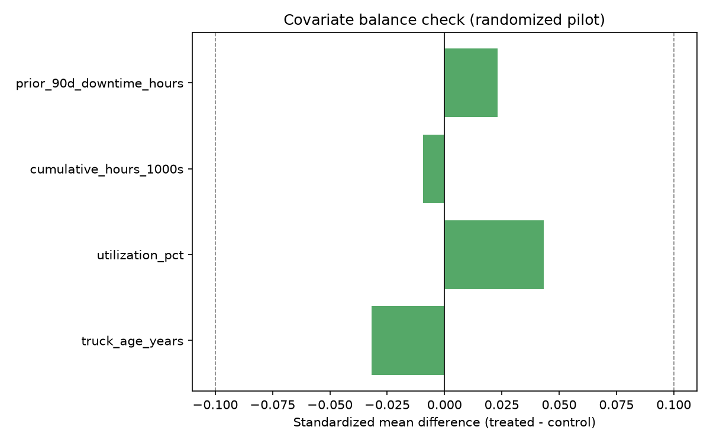

**Efecto promedio**: ATE ingenuo por diferencia de medias (set de entrenamiento) = **10,69h ahorradas**; ATE real sobre el set de test = **7,17h ahorradas** — la estimación ingenua sobreestima el efecto promedio real, un recordatorio de que incluso la simple diferencia de medias de un piloto aleatorizado es una estimación ruidosa de una sola muestra del efecto promedio real, no el efecto promedio real en sí.

**Comparación de estimadores de CATE** — coeficiente Qini (la métrica disponible sin verdad base) vs. correlación con el CATE real (disponible solo en esta simulación):

| Estimador | Coeficiente Qini | Correlación con CATE real |
|---|---:|---:|
| S-learner | 1233,98 | 0,569 |
| T-learner | 742,25 | 0,349 |
| X-learner | 993,57 | 0,478 |
| Causal Forest DML | 973,96 | **0,888** |
| **Doblemente Robusto (DRLearner)** | **1254,65** | 0,799 |

**Hallazgo honesto, sin suavizar**: el Doubly Robust learner tiene el score Qini de un solo split *más alto* de los 5 estimadores, y sin embargo el Causal Forest DML sigue recuperando el efecto individual *real* un poco mejor (correlación 0,888 vs. 0,799) — el modelo que se vería mejor por la única métrica disponible en un despliegue real no es exactamente el modelo que realmente está más cerca de ser correcto, aunque acá la brecha entre ambos es mucho más angosta que la que había frente al S-learner solamente. Este proyecto elige el Causal Forest DML para el análisis de calibración y targeting de abajo precisamente porque la recuperación de verdad base es verificable acá; la lección real para un despliegue sin verdad base es que el score Qini de un solo split de train/test es suficientemente ruidoso como para rankear estimadores distinto de cómo rankearían contra el efecto real, y un Qini validado cruzadamente sobre varios splits es la mitigación práctica.

**Un segundo hallazgo honesto, esta vez sobre construir el estimador mismo**: los números del Doubly Robust de arriba son de una versión *corregida*. La primera versión (`DRLearner` con etapa final flexible de LightGBM y `min_propensity=0,05`, igualando la configuración de `CausalForestModel`) resultó gravemente inestable — 19,75% de las predicciones en test tenían el signo equivocado, y el rango predicho (−75h a +185h) sobrepasaba muy por encima el rango real (0,5h-39h). El mecanismo: el pseudo-resultado de un estimador doblemente robusto divide por el propensity score, y una etapa final flexible sobreajusta fácilmente el término de corrección ruidoso resultante. Cambiar la etapa final a una regresión lineal simple (el default documentado de EconML, no un workaround inventado) y subir `min_propensity` a 0,1 lo corrigió: la correlación con el CATE real pasó de 0,38 a 0,80. Ver `src/models/dr_learner.py` para el relato completo.

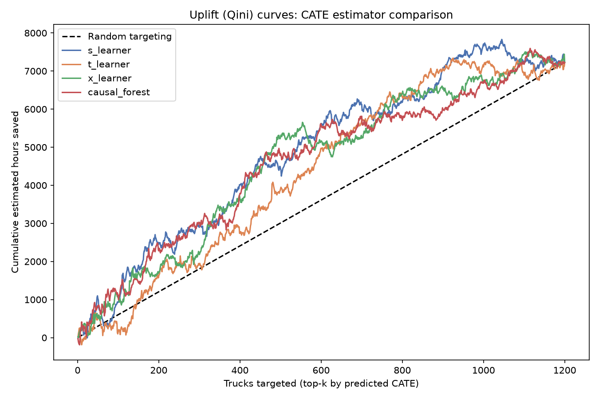
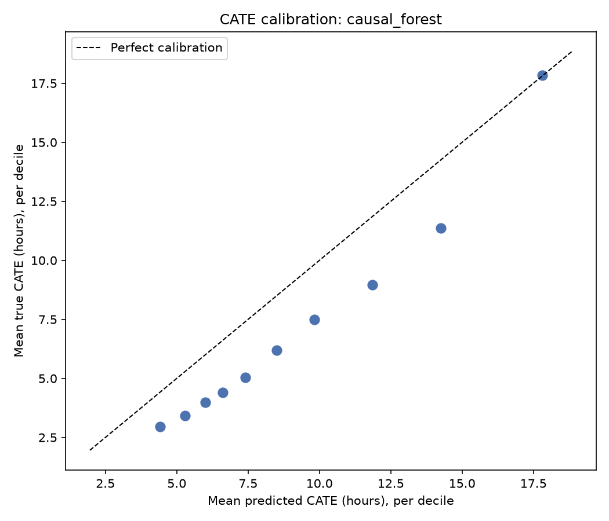

**Interactivo**: [CATE predicho vs. real, los 5 estimadores, mismo set de test](https://htmlpreview.github.io/?https://github.com/Rxyxs/chile-mining-fleet-causal-impact/blob/main/outputs/interactive/cate_estimator_comparison.html) — hacé clic en un ítem de la leyenda para activar/desactivar un estimador y pasá el mouse sobre cualquier punto para ver su valor exacto predicho/real en horas; Causal Forest DML se muestra por defecto por tener la mayor correlación de recuperación contra la verdad base. Generado por [`src/visualization/interactive_plots.py`](src/visualization/interactive_plots.py), que reajusta los mismos 5 estimadores sobre el mismo split semilla-42 usado en todo este README — no es una corrida separada ni ilustrativa.

## 7.2 Comparación de políticas de targeting (presupuesto del 30% de la flota, 360 camiones)

| Política | Horas ahorradas totales (contrafactual real) | % de lo alcanzable |
|---|---:|---:|
| Oráculo (uplift real) | 4.690,87 | 100,0% |
| **Uplift predicho (Causal Forest DML)** | **4.582,00** | **97,7%** |
| Mayor riesgo base | 4.208,65 | 89,7% |
| Aleatorio | 2.570,41 | 54,8% |

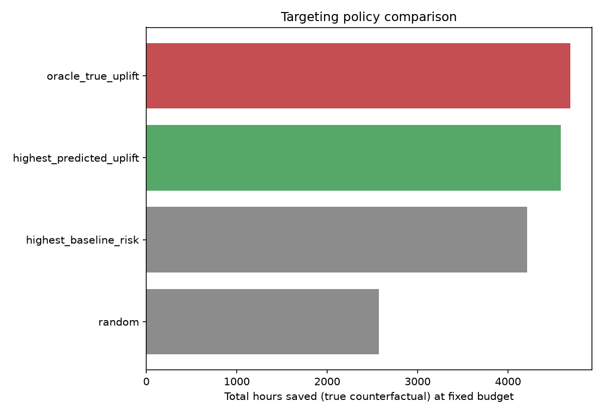

Dirigir por uplift predicho captura el 97,7% del beneficio alcanzable a este presupuesto — una mejora real y medida de 8 puntos sobre la heurística "dirigir a los camiones más riesgosos" a la que un equipo sin modelo de CATE probablemente recurriría por defecto, y más de 40 puntos sobre asignación aleatoria.

## 7.3 Parte B: diferencias-en-diferencias de adopción escalonada

**Muestra**: 32 sitios (8 por cohorte: adoptantes tempranos/medios/tardíos + nunca-tratados), 36 meses.

| Estimador | Efecto estimado | vs. efecto real (−9,12h) |
|---|---:|---:|
| TWFE ingenuo (`linearmodels.PanelOLS`) | −8,51h (se 0,62) | 6,7% de error |
| **ATT por grupo-tiempo (estimador de este proyecto)** | **−9,25h** | **1,4% de error** |
| ATT real total | −9,12h | — |

La regresión ingenua de efecto constante subestima la magnitud del efecto real — consistente con el mecanismo de Goodman-Bacon (§3.4): algunas de sus comparaciones 2x2 implícitas usan sitios ya tratados y aún mejorando como controles para adoptantes más tardíos, restando parte de un efecto real que todavía no había terminado de crecer. El estimador por grupo-tiempo, que nunca hace esa comparación, queda a 1,4% de la verdad.

La animación siguiente traza la misma serie de ATT grupo-tiempo mes a mes, facilitando ver la evolución del efecto dinámico (y su brecha respecto a la línea TWFE ingenua) mejor que una imagen estática.

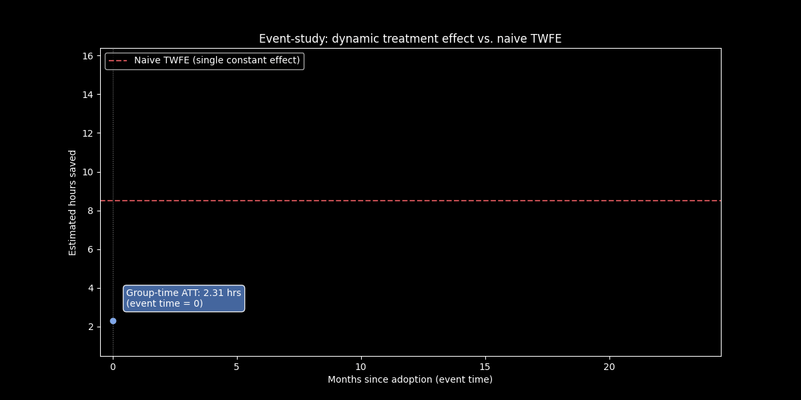
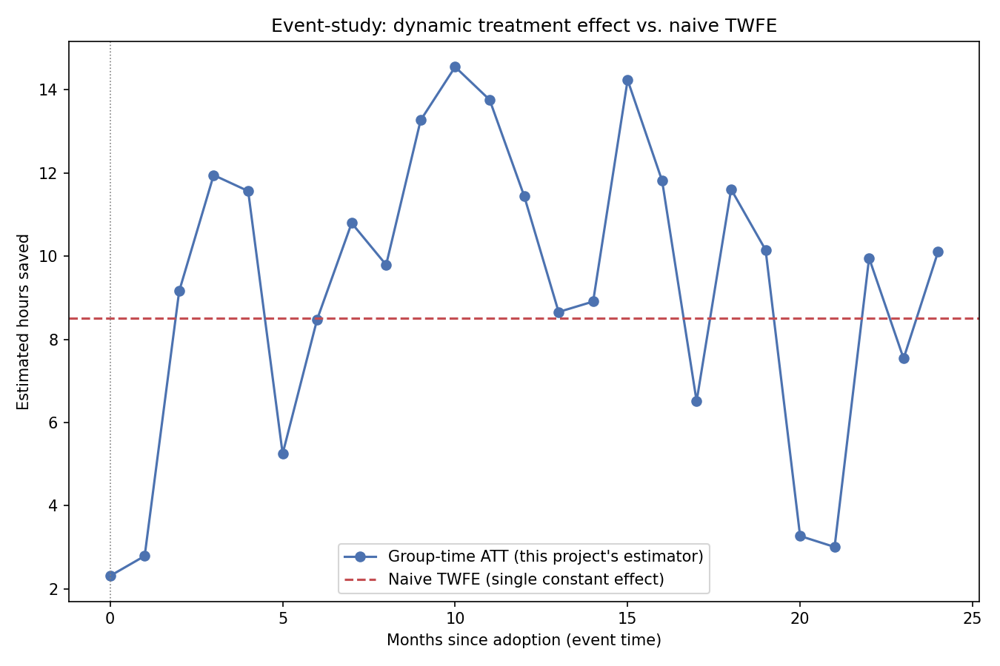

La curva de event-study muestra el efecto empezando cerca de cero en la adopción y creciendo hacia la meseta en los meses siguientes, con ruido visiblemente creciente en los tiempos-evento más tardíos — una característica honesta y estructural de un diseño escalonado: solo la cohorte que adopta más temprano tiene datos tan lejos de su propia fecha de adopción, así que los puntos de tiempo-evento más tardíos se estiman con muchos menos sitios, no con un método peor.

## 7.4 Análisis de sensibilidad: ¿cuán frágil es el ATT por grupo-tiempo?

**Prueba placebo de pre-tendencia**: repetir la misma comparación 2x2 enteramente dentro de la ventana pre-tratamiento (48 estimaciones placebo entre las 3 cohortes) da un "efecto" placebo promedio de **−0,053h** — esencialmente cero, como debería ser bajo tendencias paralelas genuinas — pero las estimaciones placebo individuales llegan hasta **13,71h** en valor absoluto, impulsadas por ruido muestral ordinario al comparar promedios de un solo mes entre 8 sitios.

**Límites honestos**: usando esos 13,71h como unidad de "mayor violación no detectada plausible", la estimación puntual (−9,25h) se mantiene acotada lejos de cero solo mientras la violación hipotetizada `M` esté por debajo de **0,70** — es decir, una violación post-tratamiento de tendencias paralelas de solo un 70% del tamaño de la *mayor estimación placebo ruidosa ya observada* bastaría para ya no poder descartar un efecto cero.

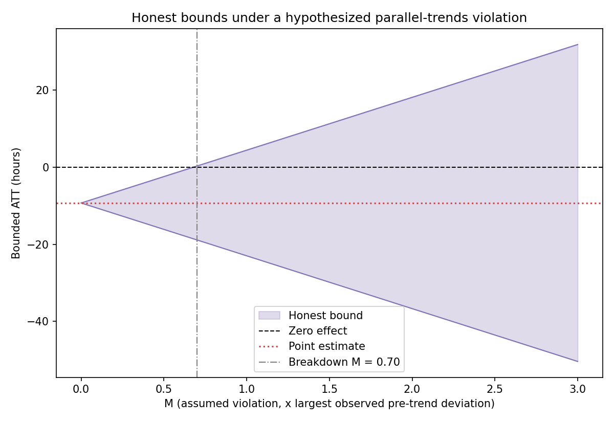

**Hallazgo honesto, sin suavizar**: un valor de quiebre de 0,70 suena frágil, y tomado solo así lo sería. Pero que la *media* de la prueba placebo sea esencialmente cero (−0,053h) entre 48 estimaciones indica que no hay una violación de pre-tendencia *sistemática* — la cifra de 13,71h que impulsa el límite es el mayor sorteo individual de estimaciones placebo ruidosas de muestra pequeña, no evidencia de una violación real. Por esto este proyecto reporta la media *y* el máximo, no solo el máximo: un límite construido a partir de la estadística más ruidosa disponible es necesariamente conservador, y un despliegue real con más sitios por cohorte (este proyecto usa 8) reduciría ese ruido y aflojaría el límite directamente, sin necesidad de asumir que la violación real es más pequeña.

**Barrido de inyección empírica**: inyectar de verdad un rango de violaciones de pre-tendencia sintéticas y re-estimar muestra que la relación es exactamente lineal, tal como predice la propia aritmética del estimador — aproximadamente **−15,5h de cambio en el ATT estimado por cada 1h/mes de violación inyectada** — un cuadro directo y medido (no solo acotado) de cuánto movería una violación de un tamaño dado a la propia conclusión de este proyecto.

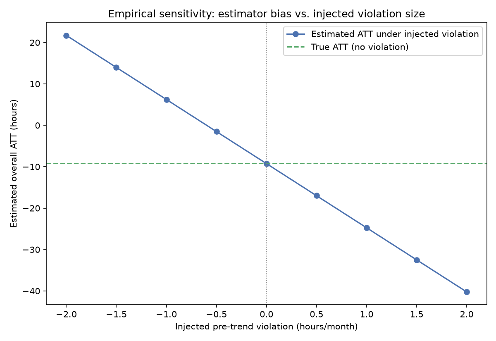

## 7.5 Almacén de comparación consultable (DuckDB)

Cada corrida de `python -m src.pipeline` también escribe `outputs/reports/results.duckdb` (`src/evaluation/results_db.py`), una base de datos DuckDB local con los mismos números de comparación de §7.1-7.3, estructurados como cuatro tablas SQL en vez de JSON anidado — útil para explorar las comparaciones de estimadores de forma ad hoc sin volver a correr el pipeline:

| Tabla | Contenido |
|---|---|
| `part_a_cate_estimator_comparison` | coeficiente Qini + correlación con el CATE verdadero por cada meta-learner, marcando el mejor según verdad base |
| `part_a_targeting_policy_comparison` | horas ahorradas y % del oráculo alcanzado, por política de targeting |
| `part_b_did_estimator_comparison` | TWFE ingenuo vs. ATT por grupo-tiempo, cada uno contra el efecto verdadero y su % de error |
| `part_b_event_study` | ATT dinámico por tiempo de evento (meses desde la adopción) |

```python
import duckdb
con = duckdb.connect("outputs/reports/results.duckdb")
con.execute("""
    SELECT estimator, qini_coefficient, cate_recovery_correlation
    FROM part_a_cate_estimator_comparison
    ORDER BY cate_recovery_correlation DESC
""").df()
```

## 7.6 Benchmark semi-sintético sobre covariables reales de sensores (Scania APS y AI4I 2020)

Para probar si los estimadores de la Parte A sobreviven a datos reales de sensores —colas pesadas, valores faltantes, bins de histograma exactamente colineales—, se volvieron a correr sobre **covariables reales** de dos datasets públicos de UCI. El tratamiento y el CATE verdadero siguen siendo simulados, así que cada estimación se puede puntuar contra una respuesta conocida. Los datasets son **Scania APS** (60.000 camiones pesados Scania en operación de carretera, 170 contadores operacionales anonimizados, 8% de celdas faltantes, mediana de |asimetría| de 17,5) y **AI4I 2020** (6 features interpretables de una máquina; su propio autor lo describe como sintético, así que acá funciona como control bien comportado, no como evidencia sobre sensores reales). Cada una de las 20 semillas sortea un piloto de 3.000 unidades, aleatoriza el tratamiento por bloques y aplica una reducción proporcional del downtime que depende de columnas reales de desgaste y estrés. En las condiciones `+ fallas reales`, la etiqueta de falla real del dataset también entra en el resultado sin tratamiento. El resultado nunca se recorta, así que el CATE verdadero registrado sigue siendo exacto. Diseño completo, ablaciones y limitaciones: [`outputs/reports/semi_synthetic_results.md`](outputs/reports/semi_synthetic_results.md).

Correlación de Pearson media con el CATE verdadero, sobre 20 semillas (1.200 unidades de test por semilla):

| Condición | Causal Forest DML | DRLearner (por defecto, etapa final OLS) | DRLearner (Ridge + log1p en columnas asimétricas) |
|---|---:|---:|---:|
| Sintético (Parte A original) | 0,813 | 0,718 | **0,816** |
| AI4I + fallas reales | 0,525 | 0,550 | **0,577** |
| Scania APS | **0,853** | −0,007 (colapsa) | 0,788 |
| Scania APS + fallas reales | **0,702** | −0,008 (colapsa) | 0,609 |

Diferencia pareada, Causal Forest menos el DRLearner con log selectivo (misma semilla y mismo split; intervalo t al 95% sobre 20 semillas):

| Condición | Recuperación del CATE (Pearson) | Valor de focalización (fracción de las horas del oráculo, top 30%) |
|---|---|---|
| Sintético | −0,003 [−0,047, +0,041] | +0,003 [−0,021, +0,027] |
| AI4I + fallas reales | −0,052 [−0,090, −0,013] | −0,039 [−0,071, −0,007] |
| Scania APS | +0,065 [+0,026, +0,103] | +0,003 [−0,034, +0,040] |
| Scania APS + fallas reales | +0,094 [+0,028, +0,160] | +0,029 [−0,024, +0,083] |

- **El DRLearner por defecto colapsa en Scania, y la causa es el espacio de features, no que los datos sean "reales".** Con el mismo código de DGP, pasar de AI4I a Scania lo lleva de 0,75 a −0,01, con 33% de predicciones de signo equivocado y errores de hasta 10⁶ veces la dispersión del CATE verdadero. Una ablación separó dos causas, y cada una por sí sola se queda corta: el log1p solo llega a 0,12, y Ridge solo a 0,32 con una variación de 0,28 entre semillas. Juntas lo recuperan. El mecanismo es la extrapolación lineal sobre contadores extremos más la colinealidad en X; la ablación no midió el ruido del pseudo-resultado.
- **La etapa final Ridge con log selectivo es la primera configuración del DRLearner que no pierde en ninguna condición.** Aplica log1p solo a las columnas con |asimetría| > 1 en el split de entrenamiento (umbral fijado antes de correr; 0,5, 2 y 5 revisados como sensibilidad). Así iguala al log global en Scania (156 de 162 columnas son asimétricas) sin la pérdida de 0,08 que el log global causa en los datos sintéticos y de AI4I. Todavía no es el valor por defecto de `DoublyRobustModel`; vive en `src/pipeline_dr_ablation.py`.
- **Causal Forest mantiene una ventaja significativa en recuperación del CATE en Scania, pero no en la decisión de focalización.** También comete menos errores de signo (2–3% frente a 7–9%). En AI4I, el DRLearner con log selectivo le gana en ambas métricas.
- **En los datos sintéticos, una etapa final Ridge por sí sola empata con Causal Forest** (0,815 frente a 0,813): la etapa final OLS elegida en la §3.5 dejaba rendimiento sin aprovechar incluso en los datos donde se validó.
- **El Qini de un solo split es demasiado ruidoso para ordenar estimadores**: su desviación estándar entre semillas va de 0,22 a 1,49 (frente a 0,06–0,17 de la correlación), y en un split el ranking por el CATE verdadero puntuó por debajo de varios estimados.

```powershell
python -m src.data.download_real_data   # Scania APS + AI4I 2020 desde UCI a data/raw/
python -m src.pipeline_real_data         # 5 condiciones x 20 semillas x 5 estimadores
python -m src.pipeline_dr_ablation       # ablación de la etapa final del DRLearner
python -m src.pipeline_real_did         # Parte B con datos reales (mpdta), ~40 s
python -m src.pipeline_real_rct         # Parte A en un ensayo aleatorizado real (Hillstrom), ~7 min
```

## 7.7 Validación con datos reales, sin simulador

Los datos reales nunca revelan el efecto verdadero, así que lo que se puede comprobar ahí es distinto de §7.1-7.3: si una implementación coincide con otra independiente, y si un ranking se sostiene en un experimento aleatorizado genuino. Ambas comprobaciones usan **datasets públicos que no tienen nada que ver con minería**; prueban los estimadores, no la historia del mantenimiento. Se reproducen con `python -m src.pipeline_real_did` (~40 s) y `python -m src.pipeline_real_rct` (~7 min).

### Parte B con `mpdta`: coincidencia con una implementación independiente

`mpdta` es un panel de condados (500 condados de EE. UU., 2003-2007) con un despliegue escalonado de alzas del salario mínimo, el ejemplo de referencia de Callaway & Sant'Anna (2021): cohortes de 20, 40 y 131 condados adoptan en 2004, 2006 y 2007, y 309 condados nunca adoptan. El resultado es el logaritmo del empleo adolescente. El estimador ATT por grupo-tiempo de §3.4 se corre con el período inmediatamente anterior a la adopción como base y se compara, celda por celda, con el paquete `csdid` (un port del paquete `did` de los autores).

| Estimador | Efecto global | Incertidumbre |
|---|---|---|
| Referencia `csdid` | −0,040 | EE 0,012 |
| Este proyecto, ponderado por cohorte | −0,040 | EE bootstrap 0,012; intervalo 95% −0,063 a −0,019 (500 réplicas, por conglomerados de condado) |
| Efectos fijos de dos vías ingenuo | −0,0365 | EE 0,015; intervalo 95% −0,066 a −0,008 |
| Promedio simple de las celdas | −0,056 | no calculada |

Las siete celdas ATT(g,t) posteriores al tratamiento coinciden con la referencia con diferencia máxima de **0,00005** (la referencia imprime cuatro decimales).

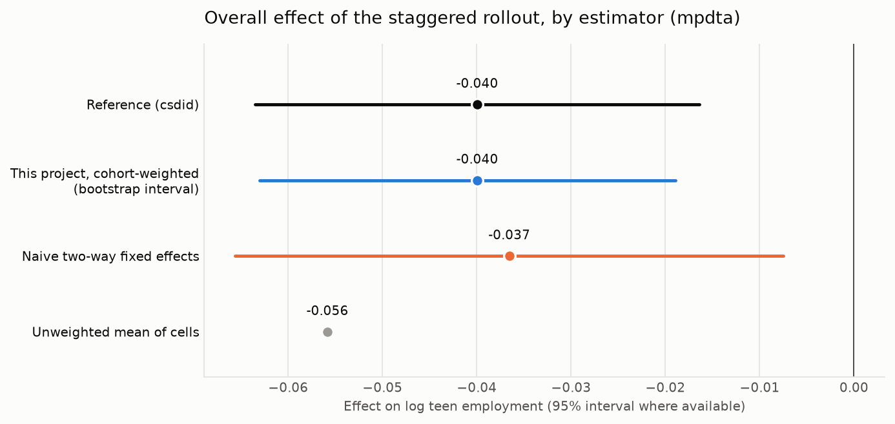

- **Esto comprueba la implementación, no la economía.** El código reproduce una referencia sobre datos para los que no fue diseñado.
- **El promedio simple (−0,056) responde otra pregunta.** Cada celda pesa lo mismo, así que la cohorte de 20 condados pesa igual que la de 131. Ponderar por tamaño de cohorte reproduce el −0,040 de la referencia. Un simple "promedio de celdas" no es un default seguro.
- **En este panel el TWFE ingenuo (−0,0365) queda cerca de la estimación corregida**, a diferencia del panel simulado de §7.3, donde se desviaba 6,7%. No investigué por qué; el tamaño de ese sesgo depende de cómo difieren los efectos entre cohortes y en el tiempo, y nada obliga a que este panel se parezca al simulado.

Límites: sin covariables, solo controles nunca tratados, cinco períodos, y las estimaciones por celda no traen error estándar aquí (solo el efecto global tiene intervalo bootstrap).

### Parte A con el experimento de e-mail de Hillstrom: rankings de CATE en un ensayo aleatorizado real

A 64.000 clientes se les envió al azar una campaña de e-mail para hombres, una para mujeres, o nada. Cada campaña se compara con el control sin e-mail (cerca de 42.600 clientes por comparación) y el resultado es si el cliente visitó el sitio. Como la asignación fue aleatoria, una partición retenida del 40% puntúa directamente el ranking de cada estimador. La tabla da el efecto del e-mail sobre la tasa de visitas entre el 30% de clientes retenidos que cada estimador ubica más arriba, frente al efecto cuando se elige al azar un 30%, promediado sobre 20 particiones aleatorias.

| Campaña (efecto aleatorizado sobre visitas) | Estimador | Efecto en el 30% superior | Focalización al azar | Particiones donde el Qini supera al azar (p < 0,05) |
|---|---|---|---|---|
| Mujeres (+4,5 pp; IC 95% +3,9 a +5,2) | Bosque causal | 7,3 pp | 4,3 pp | 20 / 20 |
| | Doblemente robusto | 7,2 pp | 4,3 pp | 20 / 20 |
| | S-learner | 7,0 pp | 4,3 pp | 20 / 20 |
| | X-learner | 6,5 pp | 4,3 pp | 20 / 20 |
| | T-learner | 6,0 pp | 4,3 pp | 18 / 20 |
| Hombres (+7,7 pp; IC 95% +7,0 a +8,3) | S-learner | 8,8 pp | 7,7 pp | 6 / 20 |
| | Doblemente robusto | 8,8 pp | 7,7 pp | 4 / 20 |
| | X-learner | 8,4 pp | 7,7 pp | 3 / 20 |
| | T-learner | 8,3 pp | 7,7 pp | 4 / 20 |
| | Bosque causal | 7,6 pp | 7,7 pp | 1 / 20 |

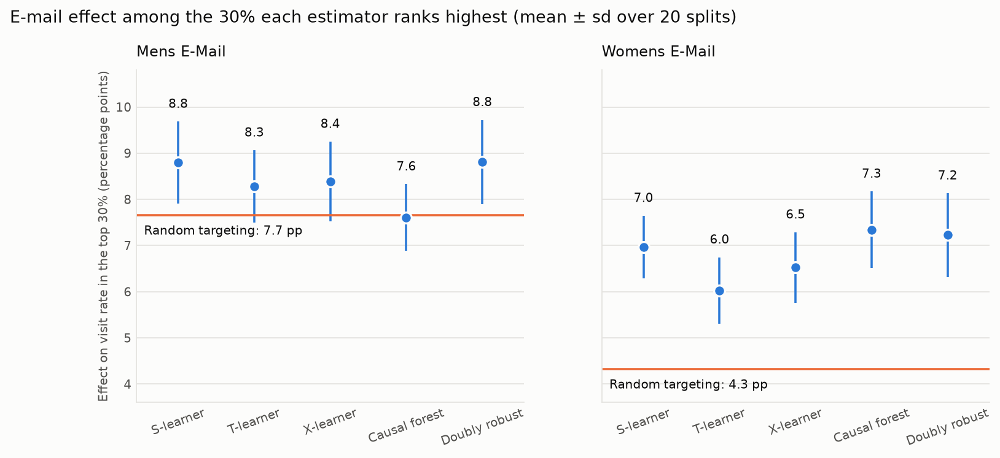

- **Campaña para mujeres: heterogeneidad real.** Todos los estimadores superan a la focalización al azar, y focalizar el 30% superior sube el efecto de 4,3 pp a entre 6,0 y 7,3 pp. Bosque causal y doblemente robusto lideran; el T-learner queda último.
- **Campaña para hombres: casi nada que aprovechar.** El efecto promedio es grande (+7,7 pp) pero quién lo recibe casi no varía con las covariables. El Qini supera al azar en solo 1 a 6 de 20 particiones, y los mejores estimadores ganan cerca de 1,1 pp sobre la focalización al azar, con una dispersión entre particiones de cerca de 0,9 pp. El bosque causal no es mejor que el azar (7,6 contra 7,7).
- **Ningún estimador gana en ambas campañas**: el bosque causal es primero en la de mujeres y último en la de hombres. La §7.1 lo tenía primero en recuperación del CATE en la simulación; el ranking de estimadores depende de los datos con que se mide.
- **La dispersión entre particiones es sensibilidad a la partición, no un intervalo de confianza.** Las 20 particiones reutilizan los mismos clientes, así que no doy intervalo sobre las cifras de focalización.

Límites: solo se analiza el resultado de visitas (no corrí compras ni gasto), los p-valores de permutación no están corregidos por probar cinco estimadores en dos campañas, y las covariables son unos pocos campos del historial del cliente.

---

# 8. Conclusión

- **Dos diseños de inferencia causal genuinamente distintos, aplicados a la misma intervención, ambos validados contra una respuesta real conocida**: heterogeneidad a nivel individual desde un piloto aleatorizado (§7.1-7.2), y un efecto agregado desde un despliegue escalonado y no aleatorizado (§7.3) — las dos situaciones que un científico de datos más comúnmente tiene que distinguir antes de elegir un método.
- **El modelo con mejor desempeño según la métrica que realmente se tendría en producción (Qini) no fue el modelo más cercano a la verdad** (§7.1) — reportado honestamente en vez de elegir el ranking que hiciera la narrativa más prolija, y usado como base de una recomendación concreta (Qini validado cruzadamente, no un solo split) en vez de dejarlo como una advertencia sin resolver.
- **El targeting basado en uplift entregó una mejora real y cuantificada sobre una heurística basada en riesgo** (97,7% vs. 89,7% del beneficio alcanzable a presupuesto fijo, §7.2) — el caso de negocio concreto para construir un modelo de CATE, en vez de recurrir por defecto a "dirigir a quien se ve más riesgoso".
- **El sesgo de la regresión TWFE ingenua bajo adopción escalonada no es una abstracción de manual acá** — produjo una estimación con 6,7% de error respecto al efecto real, sobre los propios datos simulados de este proyecto, por el mecanismo específico (unidades ya tratadas como controles inválidos bajo un efecto dinámico) que describe la literatura reciente de DiD, y el 1,4% de error del estimador corregido es el pago directo y medido de tomarlo en cuenta.
- **La estimación doblemente robusta cerró la mayor parte de la brecha Qini-vs-verdad-base, pero no toda, y construirla expuso una falla real de muestra finita** (§7.1): una etapa final flexible convirtió un estimador teóricamente sólido en uno con 19,75% de predicciones de signo equivocado, corregido solo al cambiar a la etapa final más simple que recomiendan los propios autores del método — un recordatorio concreto de que "doblemente robusto" es una garantía de consistencia de muestra grande, no una garantía de estabilidad de muestra finita.
- **La corrección del DRLearner no se transfirió a datos reales de sensores, y el benchmark lo mostró** (§7.6): con las covariables de Scania, de cola pesada y colineales, la etapa final OLS colapsó a una correlación de −0,01 con el CATE verdadero. Una ablación mostró que ni una transformación log ni Ridge bastaban por separado; juntos, con log1p solo en las columnas asimétricas, lo recuperaron a 0,61–0,79 sin empeorar ninguna otra condición. Causal Forest siguió liderando la recuperación del CATE ahí, pero no de forma significativa en la decisión de focalización, y perdió frente al DRLearner con Ridge en AI4I: lo que los datos respaldan es "el más robusto", no "el mejor en todo".
- **La conclusión del ATT por grupo-tiempo no es maximamente frágil, pero tampoco es a prueba de balas** (§7.4): un valor de quiebre de 0,70 (relativo a la estimación placebo individual más ruidosa) suena alarmante aislado, pero la media casi cero de la prueba placebo entre 48 estimaciones muestra que no hay una violación sistemática detrás — el ejercicio de límites honestos vale precisamente porque expone esa distinción en vez de reportar solo una estimación puntual y un p-value.
- **Fuera del simulador los estimadores se sostuvieron, con salvedades** (§7.7): el ATT por grupo-tiempo coincide con una implementación independiente con diferencia de 0,00005 sobre un panel real de condados, y en un ensayo aleatorizado real de e-mail los estimadores de CATE encuentran heterogeneidad genuina en una campaña y casi ninguna en la otra, sin que ningún estimador sea el mejor en ambas. Nada de esto son datos mineros; valida los métodos, no las conclusiones sobre mantenimiento.

## Próximos pasos

- **Aún-no-tratados como grupo de comparación** (la otra variante de Callaway & Sant'Anna), para chequear cuánto afecta el resultado la elección de usar solo nunca-tratados.
- **Más sitios por cohorte**, para reducir directamente el ruido muestral de la prueba placebo y ver cuánto eso solo ajusta el valor de quiebre de los límites honestos, sin cambiar nada sobre la violación asumida.
- **Las clases de restricción completas de Rambachan & Roth (2023)** (suavidad, restricciones de signo), no solo el límite simplificado de magnitudes relativas implementado acá.
- **Una política de targeting consciente del costo** que pondere el costo de mantenimiento de cada camión contra su uplift predicho, en vez de rankear solo por uplift.

---

# 9. Fuente de datos y licencia

Los dos datasets del pipeline principal son **simulados sintéticamente** (`src/data/simulate_rct.py`, `src/data/simulate_staggered_did.py`) con una semilla fija (42) — el pipeline principal no depende de datos externos. Cada simulador se construye con un efecto de tratamiento real conocido específicamente para que los estimadores de este proyecto puedan validarse contra una respuesta real, algo que no es observable en ningún problema de inferencia causal del mundo real.

El benchmark semi-sintético (§7.6) usa covariables reales de dos datasets públicos, que `src/data/download_real_data.py` descarga desde el UCI Machine Learning Repository y que no se redistribuyen acá:

- **APS Failure at Scania Trucks** — Scania CV AB (2016), [UCI #421](https://archive.ics.uci.edu/dataset/421/aps+failure+at+scania+trucks), publicado por UCI bajo CC BY 4.0 (la cabecera del propio archivo de datos indica GNU GPL v3).
- **AI4I 2020 Predictive Maintenance Dataset** — S. Matzka (2020), [UCI #601](https://archive.ics.uci.edu/dataset/601/ai4i+2020+predictive+maintenance+dataset), CC BY 4.0.

La validación con datos reales (§7.7) descarga dos datasets públicos adicionales con `src/data/real_data.py` y no los redistribuye: `mpdta`, distribuido con el paquete de R `did` de Callaway & Sant'Anna ([bcallaway11/did](https://github.com/bcallaway11/did)), y el experimento de e-mail de Hillstrom (Kevin Hillstrom, MineThatData E-Mail Analytics and Data Mining Challenge, 2008), obtenido desde un espejo público. No verifiqué una licencia para ninguno, por lo que ninguno está versionado acá.

Código: MIT — ver [LICENSE](LICENSE).

# 10. Autor

**Pablo Reyes** — [github.com/Rxyxs](https://github.com/Rxyxs)
