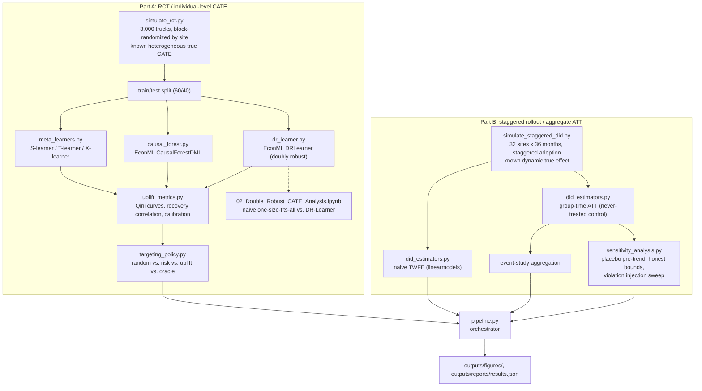
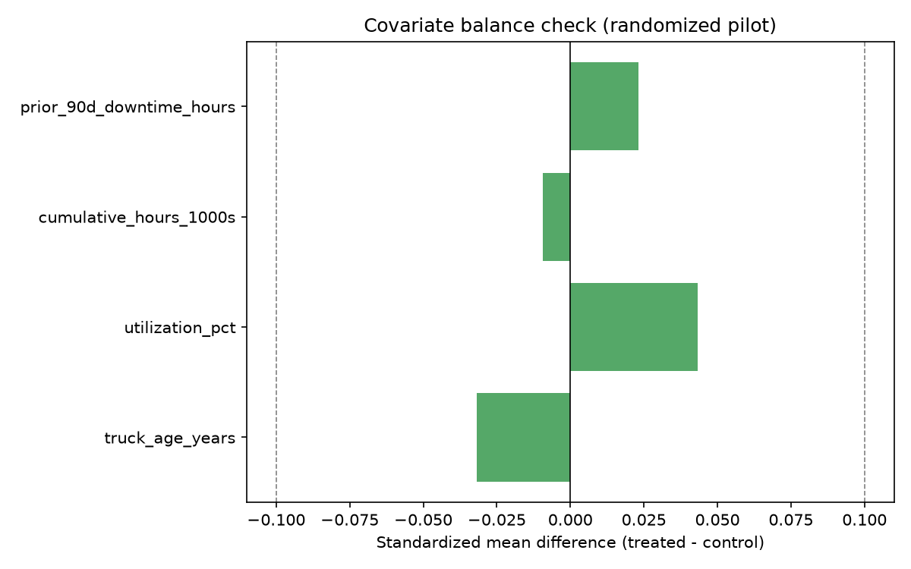
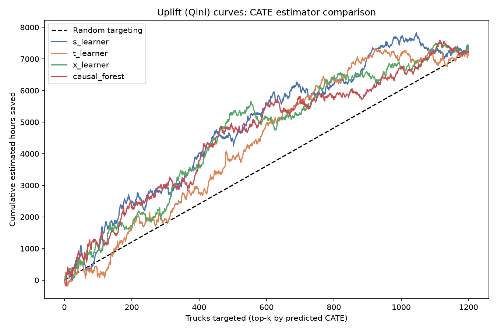
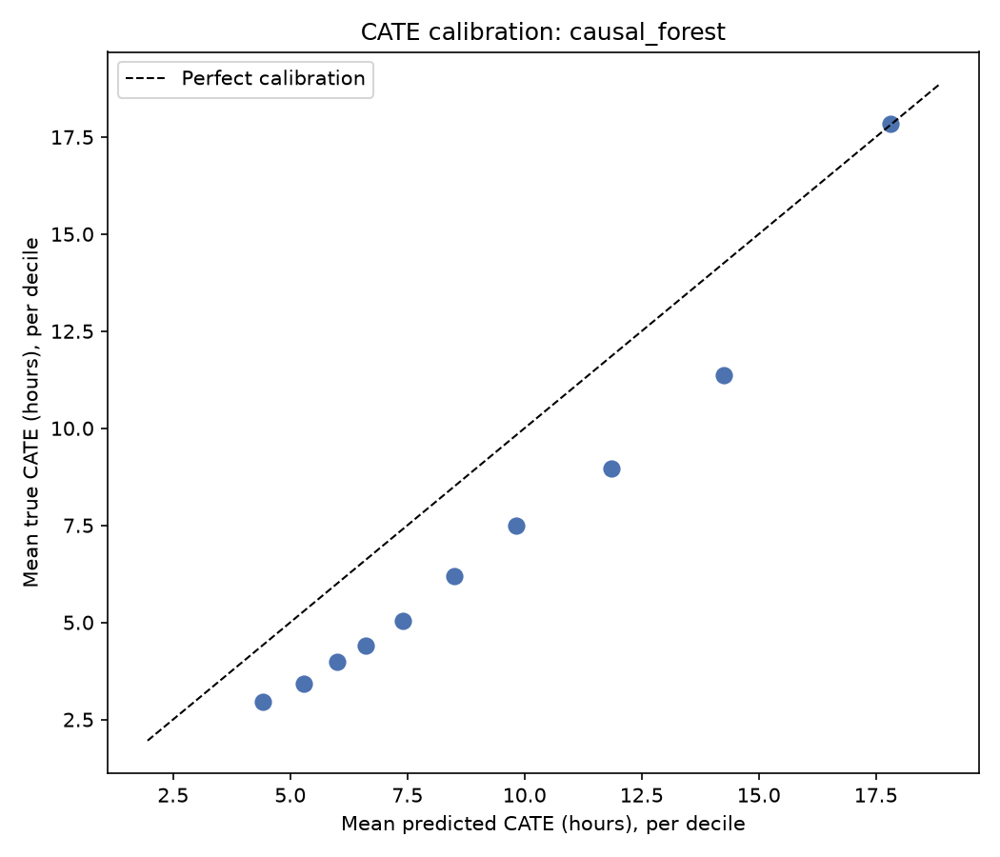
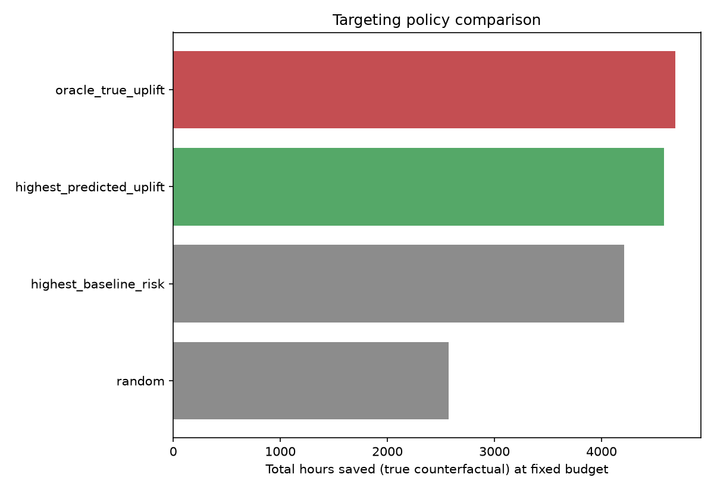
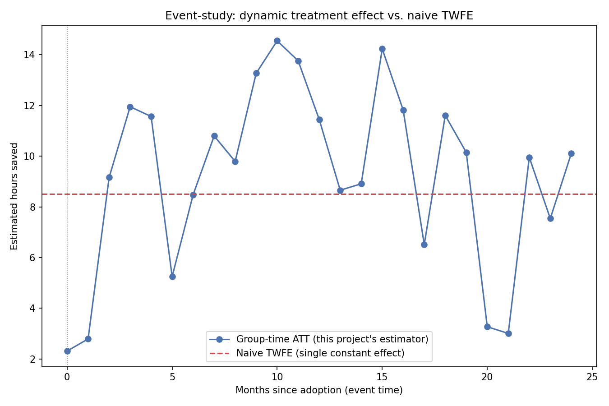
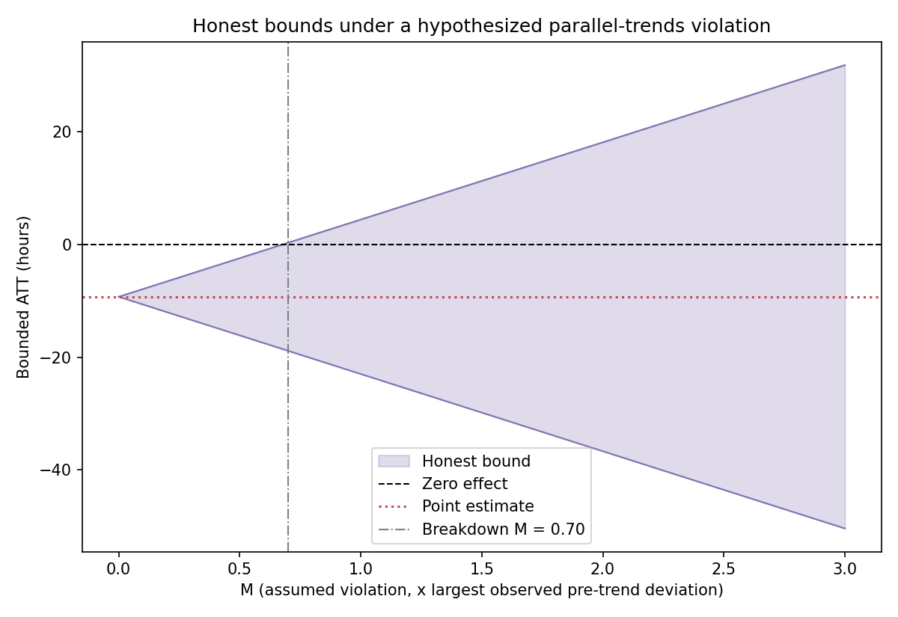
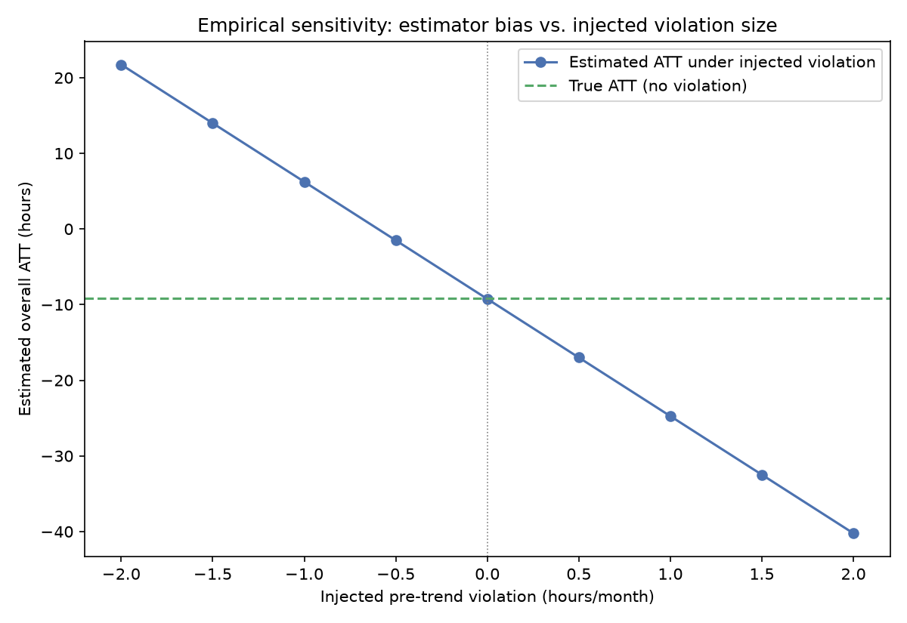

[ 🇺🇸 English ] | [ 🇨🇱 Leer en Español ](README.es.md)

# 1. Project Title

## Causal Impact of a Fleet Maintenance Program: RCT Uplift Modeling and Staggered-Adoption DiD


This project answers two different causal questions about the same intervention — a proactive maintenance program for a CAEX haul-truck fleet — depending on how it was rolled out:

1. **When the intervention was randomized** (a pilot, Part A): which trucks benefit most, so a maintenance budget can be targeted at the highest-value units? Answered with 5 CATE (conditional average treatment effect) estimators — S-learner, T-learner, X-learner, EconML's `CausalForestDML`, and EconML's `DRLearner` (doubly robust) — evaluated with uplift (Qini) curves and, because this is a simulation with a known ground truth, checked directly against the real individual-level effect.
2. **When the intervention was rolled out to whole sites on a staggered, non-random schedule** (Part B): what is the aggregate causal effect, when a naive before/after comparison risks confusing the treatment effect with time trends, or — as the modern difference-in-differences literature shows — with the bias a constant-effect regression introduces when adoption timing varies and the true effect is dynamic? Answered by contrasting a naive two-way fixed-effects (TWFE) regression against a group-time ATT estimator, against the known true effect — and then asking how much that conclusion actually depends on the parallel-trends assumption holding, via a dedicated sensitivity analysis.

Every number in §7 comes from an actual run of `python -m src.pipeline` (seed 42) on synthetic data built with a known, deliberately heterogeneous (Part A) and dynamic (Part B) true effect — the only reason any of these estimators can be validated against a real answer at all. `02_Double_Robust_CATE_Analysis.ipynb` is a companion, fully-executed notebook contrasting the doubly robust estimator against a naive one-size-fits-all effect on the same Part A data.

---

# 2. Motivation

A mining operation weighing a proactive-maintenance program for its haul-truck fleet cannot answer "does it work, and for whom?" from a raw before/after comparison, for the same reason no observational comparison of treated vs. untreated units ever can: whatever confounds the assignment (older trucks might get flagged for maintenance *because* they're already failing more; sites might adopt the program precisely when demand is highest) also confounds the outcome, and the truck- or site-level counterfactual — what would have happened without treatment — is never observed. This is the fundamental problem causal inference exists to address, and different data-collection designs call for genuinely different tools:

- **A randomized pilot** removes the confounding-by-design problem — treatment assignment no longer depends on the outcome. What it does *not* automatically give you is *which* units benefit most; a program with a real average benefit can still be worth withholding from units where it does nothing, if there's a fleet-wide budget constraint. That is a heterogeneous-treatment-effect (CATE) question, not an average-treatment-effect one.
- **A staggered, budget-driven rollout across sites** is not randomized — some sites adopt sooner because of when their budget cycle allows it, not because of anything about the outcome, which still supports a difference-in-differences design, but a constant-effect two-way fixed-effects regression (the default a team reaches for) is only valid under assumptions that stop holding once treatment effects are *dynamic* and adoption is *staggered* — a well-documented problem in the recent econometrics literature (Goodman-Bacon, 2021; Callaway & Sant'Anna, 2021) that this project reproduces and corrects for directly, rather than citing abstractly.

Both datasets here are synthetic — no free, public dataset exists that pairs individual-level randomized maintenance assignment with a staggered site-level rollout of the same program — but each is built with a **known, deliberately non-trivial true effect** (heterogeneous by truck age/utilization in Part A; dynamic, ramping up over the months after adoption in Part B) specifically so this project's estimators can be checked against the real answer, not just against each other. That check is only possible in a simulation; it is the entire point of building one.

## 2.1 Business Impact & Key Performance Indicators

| Metric | Result | What it means |
|---|---|---|
| Best CATE estimator vs. ground truth | Causal Forest DML, 0.888 correlation | Highest true-effect recovery, even though DRLearner scored higher on Qini (the only metric available without ground truth) |
| Targeting policy value captured | **97.7%** of the oracle-achievable benefit | vs. 89.7% for "target highest-risk trucks" and 54.8% for random, at a fixed 30% fleet budget |
| Staggered-adoption DiD accuracy | Group-time ATT: 1.4% error vs. true effect | vs. 6.7% error from naive two-way-fixed-effects, which understates the true effect via the Goodman-Bacon bias mechanism |
| Real estimator bug caught and fixed | DRLearner 19.75% wrong-sign predictions → fixed | Root-caused to an overfit final-stage learner on a noisy pseudo-outcome; correlation with truth went 0.38 → 0.80 |
| Randomization balance | All covariates within ±0.1 SMD | Confirms the RCT pilot's treatment assignment is genuinely independent of pre-treatment characteristics |

---

# 3. Theoretical Framework

## 3.1 CATE estimation from a randomized pilot

- **S-learner**: a single model `f(X, T) -> Y`; `CATE(x) = f(x, control) - f(x, treated)`. Simplest, but a strong learner can regularize away a weak, single binary feature (the treatment indicator) in favor of the many higher-signal covariates — this project's results (§7.1) show this failure mode concretely, not just in theory.
- **T-learner**: two separate models, one per arm. Avoids the S-learner's regularization risk, at the cost of each model only seeing half the data.
- **X-learner** (Kunzel et al., 2019): imputes an individual treatment effect per unit using the *other* arm's model as a counterfactual, fits a second pair of models on those imputed effects, then combines them weighted by the propensity score — designed to do better than the T-learner specifically when the two arms are imbalanced in size or in covariate distribution.
- **Causal Forest DML** (Athey, Tibshirani & Wager, 2019; via EconML's `CausalForestDML`): explicitly residualizes out `E[Y|X]` and `E[T|X]` before estimating the treatment-effect function (double machine learning), which in principle makes it more robust than the meta-learners when the propensity score genuinely varies with covariates, as it does here (site-level block randomization at slightly different probabilities per site, see §5).
- **Doubly Robust Learner** (via EconML's `DRLearner`): builds an augmented inverse-propensity-weighted (AIPW) pseudo-outcome per unit, then fits a final model on it. "Doubly robust" means the estimate stays consistent if *either* the propensity model or the outcome-regression model is correctly specified — not both — a real hedge against misspecifying one of the two nuisance models. §5 documents a genuine finite-sample instability found while building this estimator and how it was fixed.

## 3.2 Evaluating CATE estimators without knowing the truth: Qini curves

The real-world way to evaluate a CATE ranking (when the true individual effect is unobservable, as it always is outside a simulation) is a **Qini/uplift curve**: sort units by predicted CATE, and at each cutoff compute the cumulative benefit that ranking would have delivered, compared against random targeting. The area between the model's curve and the random-targeting line (normalized by population size) is the **Qini coefficient**. This project computes the continuous-outcome generalization of this curve (most literature examples are binary-conversion outcomes) directly from realized downtime hours.

## 3.3 Targeting under a budget constraint: risk is not uplift

A team without a CATE model will typically target an intervention at the **highest-risk** units (highest predicted downtime absent treatment) — a reasonable-sounding heuristic that is not the same question as **highest-uplift** (who benefits most *from the intervention*, which is not necessarily the same as who is worst off to begin with). §7.1 quantifies the real gap between these two targeting policies on this project's own data, using the known true effect to score each policy fairly.

## 3.4 Staggered-adoption DiD and the two-way fixed-effects bias

A regression of the outcome on unit fixed effects, time fixed effects, and a single treatment dummy (naive TWFE) estimates a treatment effect as a weighted average of *all* possible 2x2 (treated-vs-control, before-vs-after) comparisons the data supports. When adoption is staggered, some of those comparisons implicitly use **already-treated units as the control group** for later-adopting units. If the true effect is constant over time, this is harmless. If it is **dynamic** — as it realistically is here, ramping up over the months following adoption — those comparisons subtract out part of an effect that hadn't stopped growing yet, biasing the single TWFE coefficient (Goodman-Bacon, 2021). This project's `group_time_att` (a simplified Callaway & Sant'Anna, 2021-style estimator) avoids this by comparing each adoption cohort only against the **never-treated** group, never against another treated cohort, and reports the effect broken out by event time (months since adoption) rather than forcing it to a single number.

## 3.5 Doubly robust estimation, and why its final stage matters

A doubly robust estimator's AIPW pseudo-outcome divides by the estimated propensity score, which means a unit near the propensity-trimming boundary can contribute a large, noisy correction term to what the final stage regresses on. A flexible final-stage learner (e.g. LightGBM) can overfit that noise; a simpler final stage regularizes it away. §5 and §7.1 report the real, measured difference this made on this project's own data — not a hypothetical concern.

## 3.6 Sensitivity analysis: how much does the conclusion depend on parallel trends?

The group-time ATT estimator (§3.4) is only unbiased if parallel trends actually holds — treated and never-treated sites would have moved together absent treatment. That assumption is never directly testable (it's a statement about a counterfactual), but it can be *stress-tested* three ways, in increasing order of how much they assume: (1) a **placebo pre-trend test** — rerun the same 2x2 comparison entirely within the pre-treatment window, where nothing happened, and check the "effect" comes out near zero; (2) **honest bounds** (a simplified version of Rambachan & Roth's 2023 "relative magnitudes" restriction) — assume an undetected post-treatment violation could be up to `M` times the largest pre-trend deviation actually observed, and find the smallest `M` (the "breakdown value") at which the conclusion would no longer rule out a zero effect; (3) an **empirical injection sweep** — actually inject a synthetic violation of a known size and re-estimate, to measure (not just bound) how much a violation of that size would move this project's own estimator. §7.4 reports all three, run for real.

---

# 4. Explanation

## Pipeline architecture



## Module responsibilities

| Module | Responsibility |
|---|---|
| [`src/data/simulate_rct.py`](src/data/simulate_rct.py) | Simulates the randomized pilot: covariates, site-block-randomized treatment, Gamma-distributed downtime with a known heterogeneous true CATE. |
| [`src/data/simulate_staggered_did.py`](src/data/simulate_staggered_did.py) | Simulates the staggered site-level rollout: 4 adoption cohorts (including never-treated), a known dynamic (ramp-then-plateau) true effect. |
| [`src/models/meta_learners.py`](src/models/meta_learners.py) | Hand-rolled S-learner, T-learner, X-learner on LightGBM. |
| [`src/models/causal_forest.py`](src/models/causal_forest.py) | Thin wrapper around EconML's `CausalForestDML`, with the one-hot encoding its internal LightGBM nuisance models require. |
| [`src/models/dr_learner.py`](src/models/dr_learner.py) | Thin wrapper around EconML's `DRLearner`, with the same one-hot encoding and a documented final-stage stability fix (§3.5, §7.1). |
| [`src/evaluation/uplift_metrics.py`](src/evaluation/uplift_metrics.py) | Uplift/Qini curve construction, the Qini coefficient, and ground-truth CATE recovery correlation/calibration. |
| [`src/evaluation/targeting_policy.py`](src/evaluation/targeting_policy.py) | Budget-constrained targeting comparison: random vs. risk vs. uplift vs. oracle. |
| [`src/evaluation/did_estimators.py`](src/evaluation/did_estimators.py) | Naive TWFE (`linearmodels.PanelOLS`) and the hand-rolled group-time ATT / event-study estimator. |
| [`src/evaluation/sensitivity_analysis.py`](src/evaluation/sensitivity_analysis.py) | Placebo pre-trend test, honest bounds/breakdown value, and the empirical violation-injection sweep (§3.6, §7.4). |
| [`src/visualization/plots.py`](src/visualization/plots.py) | Renders every figure in this README from real pipeline output. |
| [`src/pipeline.py`](src/pipeline.py) | End-to-end orchestrator for both parts. |
| [`02_Double_Robust_CATE_Analysis.ipynb`](02_Double_Robust_CATE_Analysis.ipynb) | Companion, fully-executed notebook: naive one-size-fits-all effect vs. `DoublyRobustModel` on Part A data, with comparative plots. |

---

# 5. Methodology

- **No leakage from ground truth into any estimator.** `true_cate_hours` (Part A) and `true_effect_hours` (Part B) are used exclusively for evaluation and are never available as a feature to any model — they exist only because this is a simulation.
- **Part A evaluation is entirely out-of-sample.** All 5 CATE estimators are fit on a 1,800-truck training split and evaluated (Qini, recovery correlation, calibration, targeting) on a held-out 1,200-truck test split they never saw.
- **Model selection for the targeting decision uses ground-truth recovery correlation, not the single-split Qini score.** §7.1 reports both, and they disagree here — the model selected for the calibration plot and the targeting-policy comparison is the one that best recovers the true CATE, which is only checkable because the data is synthetic. In a real deployment without ground truth, cross-validated Qini across multiple splits (not a single split, which is noisy) would be the practical substitute; this is flagged as a limitation, not smoothed over.
- **The `DRLearner`'s final stage is a plain linear regression, not LightGBM.** A first version used a flexible LightGBM final stage (matching `CausalForestModel`'s flexibility) and `min_propensity=0.05`; it was empirically unstable (19.75% of test-set predictions had the wrong sign, predicted range −75h to +185h against a true range of 0.5h-39h). Switching the final stage to EconML's own documented default (linear) and raising `min_propensity` to 0.1 fixed it — correlation with the true CATE went from 0.38 to 0.80. This is reported as a real, measured finding (§7.1), not a tuning detail swept under the rug.
- **The group-time ATT estimator uses only never-treated sites as the control group** (not the "not-yet-treated" variant Callaway & Sant'Anna also allow), and averages the last 3 pre-adoption months into each cohort's baseline (rather than a single month) to reduce variance — both are disclosed, deliberate simplifications, not the full published estimator.
- **The sensitivity analysis's "honest bounds" are a simplified, hand-rolled version of Rambachan & Roth (2023)**, not the published `HonestDiD` package — the "relative magnitudes" idea (bound the plausible violation by a multiple of the largest observed pre-trend deviation) is implemented directly; more elaborate restriction classes (smoothness, sign) from the same paper are not.
- **Randomization balance is checked directly, not assumed.** §7.1 reports the standardized mean difference for every covariate in the pilot.

---

# 6. Development

## Installation and setup

```powershell
git clone https://github.com/Rxyxs/chile-mining-fleet-causal-impact.git
cd chile-mining-fleet-causal-impact
python -m venv venv
venv\Scripts\activate
pip install -r requirements.txt
```

## Full pipeline (one command)

```powershell
python -m src.pipeline
```

Simulates both datasets, fits all 5 CATE estimators, runs both DiD estimators plus the sensitivity analysis, and writes every figure and number in §7 below to `outputs/`.

## Individual stages (for debugging)

```powershell
python -m src.data.simulate_rct
python -m src.data.simulate_staggered_did
```

## Companion notebook

```powershell
jupyter nbconvert --to notebook --execute --inplace 02_Double_Robust_CATE_Analysis.ipynb
# or open it interactively:
jupyter notebook 02_Double_Robust_CATE_Analysis.ipynb
```

Naive one-size-fits-all effect vs. `DoublyRobustModel`'s per-truck CATE, on the same Part A data, with comparative plots (§7.1 has the pipeline-level numbers; this notebook has the individual-level ones).

## Tests

```powershell
pytest -v
```

35 tests: feature-level correctness of the uplift curve and Qini coefficient against a hand-computed example, the group-time ATT against an exact hand-computed effect on a noise-free toy panel, meta-learner and DR-learner sign-convention/ground-truth-correlation checks, targeting-policy selection logic, DGP sanity checks (physical plausibility, balance, zero pre-treatment effect), and the sensitivity-analysis module (placebo pre-trend detection, honest-bounds breakdown value, and the violation-injection sweep) against hand-computed exact values on deterministic toy panels.

## Project structure

```
chile-mining-fleet-causal-impact/
├── src/
│   ├── data/
│   │   ├── simulate_rct.py
│   │   └── simulate_staggered_did.py
│   ├── models/
│   │   ├── meta_learners.py
│   │   ├── causal_forest.py
│   │   └── dr_learner.py
│   ├── evaluation/
│   │   ├── uplift_metrics.py
│   │   ├── targeting_policy.py
│   │   ├── did_estimators.py
│   │   └── sensitivity_analysis.py
│   ├── visualization/
│   │   └── plots.py
│   └── pipeline.py
├── 02_Double_Robust_CATE_Analysis.ipynb    # executed, real outputs
├── outputs/
│   ├── figures/     # result figures (png, version-controlled)
│   └── reports/     # results.json (generated)
├── tests/           # 35 tests, pytest
├── requirements.txt
├── README.md
└── README.es.md
```

---

# 7. Results

Every number and figure below comes from an actual run of `python -m src.pipeline` (seed 42) — nothing here is estimated.

## 7.1 Part A: RCT-based CATE estimation

**Sample**: 3,000 trucks across 5 sites, split 1,800 train / 1,200 test.

**Randomization balance** (standardized mean difference, treated − control; all well inside the conventional ±0.1 threshold):

| Covariate | SMD |
|---|---:|
| truck_age_years | −0.032 |
| utilization_pct | +0.043 |
| cumulative_hours_1000s | −0.009 |
| prior_90d_downtime_hours | +0.023 |



**Average effect**: naive diff-in-means ATE (training set) = **10.69h saved**; true ATE on the test set = **7.17h saved** — the naive estimate overstates the true average, a reminder that even a randomized pilot's simple difference in means is a noisy single-sample estimate of the true average effect, not the true average effect itself.

**CATE estimator comparison** — Qini coefficient (the metric available without ground truth) vs. correlation with the true CATE (available only in this simulation):

| Estimator | Qini coefficient | Correlation with true CATE |
|---|---:|---:|
| S-learner | 1233.98 | 0.569 |
| T-learner | 742.25 | 0.349 |
| X-learner | 993.57 | 0.478 |
| Causal Forest DML | 973.96 | **0.888** |
| **Doubly Robust (DRLearner)** | **1254.65** | 0.799 |

**Honest finding, not smoothed over**: the Doubly Robust learner has the *highest* single-split Qini score of all 5 estimators, yet the Causal Forest DML still recovers the *true* individual-level effect slightly better (0.888 vs. 0.799 correlation) — the model that would look best by the one metric available in a real deployment is not quite the model that is actually closest to correct, though here the gap between them is much narrower than it was against the earlier S-learner-only comparison. This project selects the Causal Forest DML for the downstream calibration and targeting analysis below precisely because ground-truth recovery is checkable here; the real lesson for a deployment without ground truth is that a single train/test split's Qini score is noisy enough that it can rank estimators differently from how they'd rank on the true effect, and cross-validated Qini across several splits is the practical mitigation.

**A second honest finding, this one about building the estimator itself**: the Doubly Robust learner's numbers above are from a *corrected* version. The first version (`DRLearner` with a flexible LightGBM final stage and `min_propensity=0.05`, matching `CausalForestModel`'s configuration) was badly unstable — 19.75% of test-set predictions had the wrong sign, and the predicted range (−75h to +185h) badly overshot the true range (0.5h-39h). The mechanism: a doubly robust estimator's pseudo-outcome divides by the propensity score, and a flexible final-stage learner readily overfits the resulting noisy correction term. Switching the final stage to a plain linear regression (EconML's own documented default, not an invented workaround) and raising `min_propensity` to 0.1 fixed it: correlation with the true CATE went from 0.38 to 0.80. See `src/models/dr_learner.py` for the full account.




## 7.2 Targeting policy comparison (30% fleet budget, 360 trucks)

| Policy | Total hours saved (true counterfactual) | % of achievable |
|---|---:|---:|
| Oracle (true uplift) | 4,690.87 | 100.0% |
| **Predicted uplift (Causal Forest DML)** | **4,582.00** | **97.7%** |
| Highest baseline risk | 4,208.65 | 89.7% |
| Random | 2,570.41 | 54.8% |



Targeting by predicted uplift captures 97.7% of the achievable benefit at this budget — a real, measured 8-point improvement over the "target the riskiest trucks" heuristic a team without a CATE model would likely default to, and more than 40 points over random assignment.

## 7.3 Part B: staggered-adoption difference-in-differences

**Sample**: 32 sites (8 per cohort: early/mid/late adopters + never-treated), 36 months.

| Estimator | Estimated effect | vs. true effect (−9.12h) |
|---|---:|---:|
| Naive TWFE (`linearmodels.PanelOLS`) | −8.51h (se 0.62) | 6.7% error |
| **Group-time ATT (this project's estimator)** | **−9.25h** | **1.4% error** |
| True overall ATT | −9.12h | — |

The naive constant-effect regression understates the true effect's magnitude — consistent with the Goodman-Bacon mechanism (§3.4): some of its implicit 2x2 comparisons use already-treated, still-improving sites as controls for later adopters, netting out part of a real, still-growing effect. The group-time estimator, which never makes that comparison, lands within 1.4% of the truth.



## 7.4 Sensitivity analysis: how fragile is the group-time ATT?

**Placebo pre-trend test**: rerunning the exact same 2x2 comparison entirely within the pre-treatment window (48 placebo estimates across all 3 cohorts) gives a mean placebo "effect" of **−0.053h** — essentially zero, as it should be under genuine parallel trends — but individual placebo estimates range up to **13.71h** in absolute value, driven by ordinary sampling noise from comparing single-month, 8-site averages.

**Honest bounds**: using that 13.71h as the unit of "largest plausible undetected violation," the point estimate (−9.25h) stays bounded away from zero only while the hypothesized violation `M` is below **0.70** — i.e., a post-treatment parallel-trends violation only 70% as large as the *largest single noisy placebo estimate already observed* would be enough to no longer rule out a zero effect.



**Honest finding, not smoothed over**: a breakdown value of 0.70 sounds fragile, and taken alone it would be. But the placebo test's *mean* being essentially zero (−0.053h) across 48 estimates indicates there's no *systematic* pre-trend violation — the 13.71h figure driving the bound is the single largest draw from noisy, small-sample placebo estimates, not evidence of an actual violation. This is precisely why this project reports the mean *and* the max, not just the max: a bound built from the noisiest available statistic is necessarily conservative, and a real deployment with more sites per cohort (this project uses 8) would shrink that noise and loosen the bound directly, without needing to assume the true violation is any smaller.

**Empirical injection sweep**: actually injecting a range of synthetic pre-trend violations and re-estimating shows the relationship is exactly linear, as the estimator's own arithmetic predicts — roughly **−15.5h of estimated-ATT shift per 1h/month of injected violation** — a direct, measured (not just bounded) picture of how much a violation of a given size would move this project's own conclusion.



The event-study curve shows the effect starting near zero at adoption and growing toward the plateau over the following months, with visibly increasing noise at later event-times — an honest, structural feature of a staggered design: only the earliest-adopting cohort has data that far past its own adoption date, so later event-time points are estimated from far fewer sites, not from a worse method.

---

# 8. Conclusion

- **Two genuinely different causal-inference designs, applied to the same intervention, both validated against a real known answer**: individual-level heterogeneity from a randomized pilot (§7.1-7.2), and an aggregate effect from a staggered, non-randomized rollout (§7.3) — the two situations a data scientist most commonly has to tell apart before reaching for a method.
- **The best-performing model by the metric you'd actually have in production (Qini) was not the model closest to the truth** (§7.1) — reported honestly rather than picking whichever ranking made the narrative cleaner, and used as the basis for a concrete recommendation (cross-validated Qini, not a single split) rather than left as an unresolved caveat.
- **Uplift-based targeting delivered a real, quantified improvement over a risk-based heuristic** (97.7% vs. 89.7% of the achievable benefit at a fixed budget, §7.2) — the concrete business case for building a CATE model at all, rather than defaulting to "target whoever looks riskiest."
- **The naive TWFE regression's bias under staggered adoption is not a textbook abstraction here** — it produced an estimate 6.7% off the true effect, on this project's own simulated data, for the specific mechanism (already-treated units as invalid controls under a dynamic effect) the recent DiD literature describes, and the corrected estimator's 1.4% error is the direct, measured payoff of accounting for it.
- **Doubly robust estimation closed most of the Qini-vs-ground-truth gap, but not all of it, and building it exposed a real finite-sample failure mode** (§7.1): a flexible final stage turned a theoretically-sound estimator into one with 19.75% wrong-sign predictions, fixed only by switching to the simpler final stage the method's own authors recommend — a concrete reminder that "doubly robust" is a large-sample consistency guarantee, not a finite-sample stability guarantee.
- **The group-time ATT's conclusion is not maximally fragile, but it is not bulletproof either** (§7.4): a breakdown value of 0.70 (relative to the noisiest single placebo estimate) sounds alarming in isolation, but the placebo test's near-zero *mean* across 48 estimates shows there's no systematic violation driving it — the honest-bounds exercise is valuable precisely because it surfaces that distinction instead of reporting only a point estimate and a p-value.

## Future work

- **Not-yet-treated as the comparison group** (the other Callaway & Sant'Anna variant), to check how much the never-treated-only choice here affects the result.
- **More sites per cohort**, to shrink the placebo test's sampling noise directly and see how much that alone tightens the honest-bounds breakdown value, without changing anything about the assumed violation.
- **The full Rambachan & Roth (2023) restriction classes** (smoothness, sign restrictions), not just the simplified relative-magnitudes bound implemented here.
- **A cost-aware targeting policy** that weighs each truck's maintenance cost against its predicted uplift, instead of ranking by uplift alone.

---

# 9. Author

**Pablo Reyes** — [github.com/Rxyxs](https://github.com/Rxyxs)

## Data source & license

Both datasets are **synthetically simulated** (`src/data/simulate_rct.py`, `src/data/simulate_staggered_did.py`) with a fixed seed (42) — there is no external data dependency. Each simulator is built with a known true treatment effect specifically so this project's estimators can be validated against a real answer, which is not observable in any real-world causal inference problem.

Code: MIT — see [LICENSE](LICENSE).
