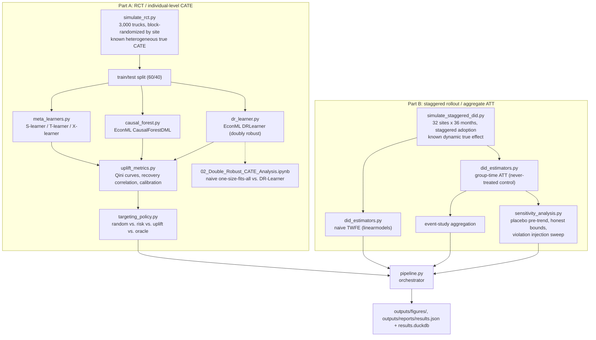

[ 🇺🇸 English ] | [ 🇨🇱 Leer en Español ](README.es.md)

**Interactive page:** https://rxyxs.github.io/chile-mining-fleet-causal-impact/ — move the fleet budget and compare the five estimators against the risk rule.

# 1. Project Title

## Causal Impact of a Fleet Maintenance Program: RCT Uplift Modeling and Staggered-Adoption DiD


This project answers two different causal questions about the same intervention — a proactive maintenance program for a CAEX haul-truck fleet — depending on how it was rolled out:

1. **When the intervention was randomized** (a pilot, Part A): which trucks benefit most, so a maintenance budget can be targeted at the highest-value units? Answered with 5 CATE (conditional average treatment effect) estimators — S-learner, T-learner, X-learner, EconML's `CausalForestDML`, and EconML's `DRLearner` (doubly robust) — evaluated with uplift (Qini) curves and, because this is a simulation with a known ground truth, checked directly against the real individual-level effect.
2. **When the intervention was rolled out to whole sites on a staggered, non-random schedule** (Part B): what is the aggregate causal effect, when a naive before/after comparison risks confusing the treatment effect with time trends, or — as the modern difference-in-differences literature shows — with the bias a constant-effect regression introduces when adoption timing varies and the true effect is dynamic? Answered by contrasting a naive two-way fixed-effects (TWFE) regression against a group-time ATT estimator, against the known true effect — and then asking how much that conclusion actually depends on the parallel-trends assumption holding, via a dedicated sensitivity analysis.

Every number in §7.1-7.5 comes from an actual run of `python -m src.pipeline` (seed 42) on synthetic data built with a known, deliberately heterogeneous (Part A) and dynamic (Part B) true effect — the only reason any of these estimators can be validated against a real answer at all. §7.6 re-runs the Part A estimators over 20 seeds on real sensor covariates (Scania APS, AI4I 2020) with a simulated treatment and a known effect. `02_Double_Robust_CATE_Analysis.ipynb` is a companion, fully-executed notebook contrasting the doubly robust estimator against a naive one-size-fits-all effect on the same Part A data.

**Real-data validation (§7.7).** A simulation can score an estimator against the true effect because it wrote that effect; real data never offers that. So §7.7 runs the same estimators on two *real* public datasets that have nothing to do with mining and checks what can be checked there: that the staggered-adoption DiD agrees with an independent implementation, and that the CATE rankings hold up on a genuine randomized trial.

---

# 2. Motivation

A mining operation weighing a proactive-maintenance program for its haul-truck fleet cannot answer "does it work, and for whom?" from a raw before/after comparison, for the same reason no observational comparison of treated vs. untreated units ever can: whatever confounds the assignment (older trucks might get flagged for maintenance *because* they're already failing more; sites might adopt the program precisely when demand is highest) also confounds the outcome, and the truck- or site-level counterfactual — what would have happened without treatment — is never observed. This is the fundamental problem causal inference exists to address, and different data-collection designs call for genuinely different tools:

- **A randomized pilot** removes the confounding-by-design problem — treatment assignment no longer depends on the outcome. What it does *not* automatically give you is *which* units benefit most; a program with a real average benefit can still be worth withholding from units where it does nothing, if there's a fleet-wide budget constraint. That is a heterogeneous-treatment-effect (CATE) question, not an average-treatment-effect one.
- **A staggered, budget-driven rollout across sites** is not randomized — some sites adopt sooner because of when their budget cycle allows it, not because of anything about the outcome, which still supports a difference-in-differences design, but a constant-effect two-way fixed-effects regression (the default a team reaches for) is only valid under assumptions that stop holding once treatment effects are *dynamic* and adoption is *staggered* — a well-documented problem in the recent econometrics literature (Goodman-Bacon, 2021; Callaway & Sant'Anna, 2021) that this project reproduces and corrects for directly, rather than citing abstractly.

Both datasets here are synthetic — no free, public dataset exists that pairs individual-level randomized maintenance assignment with a staggered site-level rollout of the same program — but each is built with a **known, deliberately non-trivial true effect** (heterogeneous by truck age/utilization in Part A; dynamic, ramping up over the months after adoption in Part B) specifically so this project's estimators can be checked against the real answer, not just against each other. That check is only possible in a simulation; it is the entire point of building one.

## 2.1 Business Impact & Key Performance Indicators

| Metric | Result | What it means |
|---|---|---|
| Best CATE estimator vs. ground truth | Causal Forest DML, 0.888 correlation (seed 42, single split) | Highest true-effect recovery, even though DRLearner scored higher on Qini (the only metric available without ground truth). Across 20 seeds the means are 0.813 (Causal Forest) vs. 0.718 (DRLearner), so the single split sits on the optimistic side (§7.6) |
| Targeting policy value captured | **94.1%** of the oracle-achievable benefit, averaged over 30 Monte Carlo seeds (Causal Forest, 30% fleet budget) | vs. 88.0% for "target highest-risk trucks" and 56.0% for random. Causal Forest beats the risk rule in 28 of the 30 runs; the S-, T- and X-learners essentially never do (2, 0 and 0 of 30). The 97.7% vs. 89.7% of the single published seed is a favorable draw, and Causal Forest was picked using the true effect (the estimator Qini picks averages 91.4%) (§7.2, [Monte Carlo report](docs/REPORTE_MONTECARLO.md)) |
| Staggered-adoption DiD: bias vs. variance (500 simulated panels) | Group-time ATT removes the systematic bias of naive TWFE (+7.1% mean understatement): mean error −0.5% | But it is noisier: σ = 15.6% vs. 8.0% for TWFE, so RMSE is 15.6% vs. 10.7% at N = 32 sites. The 1.5% error of the published panel is a favorable draw, matched or beaten by only 7.4% of panels (§7.3) |
| Real estimator bug caught and fixed | DRLearner 19.75% wrong-sign predictions → fixed | Root-caused to an overfit final-stage learner on a noisy pseudo-outcome; correlation with truth went 0.38 → 0.80 |
| Randomization balance | All covariates within ±0.1 SMD | Confirms the RCT pilot's treatment assignment is genuinely independent of pre-treatment characteristics |
| Real-sensor stress test (Scania APS, 20 seeds) | Default DRLearner collapses (r = −0.01); skew-aware Ridge final stage recovers it to 0.61–0.79 | On heavy-tailed, collinear real sensor covariates, Causal Forest still leads on CATE recovery (+0.065 to +0.094, 95% CI excludes 0), but its edge on targeting value is not significant (§7.6) |

---

# 3. Theoretical Framework

## 3.1 CATE estimation from a randomized pilot

- **S-learner**: a single model `f(X, T) -> Y`; `CATE(x) = f(x, control) - f(x, treated)`. Simplest, but a strong learner can regularize away a weak, single binary feature (the treatment indicator) in favor of the many higher-signal covariates — this project's results (§7.1) show this failure mode concretely, not just in theory.
- **T-learner**: two separate models, one per arm. Avoids the S-learner's regularization risk, at the cost of each model only seeing half the data.
- **X-learner** (Kunzel et al., 2019): imputes an individual treatment effect per unit using the *other* arm's model as a counterfactual, fits a second pair of models on those imputed effects, then combines them weighted by the propensity score — designed to do better than the T-learner specifically when the two arms are imbalanced in size or in covariate distribution.
- **Causal Forest DML** (Athey, Tibshirani & Wager, 2019; via EconML's `CausalForestDML`): explicitly residualizes out `E[Y|X]` and `E[T|X]` before estimating the treatment-effect function (double machine learning), which in principle makes it more robust than the meta-learners when the propensity score genuinely varies with covariates, as it does here (site-level block randomization at slightly different probabilities per site, see §5).
- **Doubly Robust Learner** (via EconML's `DRLearner`): builds an augmented inverse-propensity-weighted (AIPW) pseudo-outcome per unit, then fits a final model on it. "Doubly robust" means the estimate stays consistent if *either* the propensity model or the outcome-regression model is correctly specified — not both — a real hedge against misspecifying one of the two nuisance models. §5 documents a genuine finite-sample instability found while building this estimator and how it was fixed.

## 3.2 Evaluating CATE estimators without knowing the truth: Qini curves

The real-world way to evaluate a CATE ranking (when the true individual effect is unobservable, as it always is outside a simulation) is a **Qini/uplift curve**: sort units by predicted CATE, and at each cutoff compute the cumulative benefit that ranking would have delivered, compared against random targeting. The area between the model's curve and the random-targeting line (normalized by population size) is the **Qini coefficient**. This project computes the continuous-outcome generalization of this curve (most literature examples are binary-conversion outcomes) directly from realized downtime hours.

## 3.3 Targeting under a budget constraint: risk is not uplift

A team without a CATE model will typically target an intervention at the **highest-risk** units (highest predicted downtime absent treatment) — a reasonable-sounding heuristic that is not the same question as **highest-uplift** (who benefits most *from the intervention*, which is not necessarily the same as who is worst off to begin with). §7.1 quantifies the real gap between these two targeting policies on this project's own data, using the known true effect to score each policy fairly.

## 3.4 Staggered-adoption DiD and the two-way fixed-effects bias

A regression of the outcome on unit fixed effects, time fixed effects, and a single treatment dummy (naive TWFE) estimates a treatment effect as a weighted average of *all* possible 2x2 (treated-vs-control, before-vs-after) comparisons the data supports. When adoption is staggered, some of those comparisons implicitly use **already-treated units as the control group** for later-adopting units. If the true effect is constant over time, this is harmless. If it is **dynamic** — as it realistically is here, ramping up over the months following adoption — those comparisons subtract out part of an effect that hadn't stopped growing yet, biasing the single TWFE coefficient (Goodman-Bacon, 2021). This project's `group_time_att` (a simplified Callaway & Sant'Anna, 2021-style estimator) avoids this by comparing each adoption cohort only against the **never-treated** group, never against another treated cohort, and reports the effect broken out by event time (months since adoption) rather than forcing it to a single number.

## 3.5 Doubly robust estimation, and why its final stage matters

A doubly robust estimator's AIPW pseudo-outcome divides by the estimated propensity score, which means a unit near the propensity-trimming boundary can contribute a large, noisy correction term to what the final stage regresses on. A flexible final-stage learner (e.g. LightGBM) can overfit that noise; a simpler final stage regularizes it away. §5 and §7.1 report the real, measured difference this made on this project's own data — not a hypothetical concern.

## 3.6 Sensitivity analysis: how much does the conclusion depend on parallel trends?

The group-time ATT estimator (§3.4) is only unbiased if parallel trends actually holds — treated and never-treated sites would have moved together absent treatment. That assumption is never directly testable (it's a statement about a counterfactual), but it can be *stress-tested* three ways, in increasing order of how much they assume: (1) a **placebo pre-trend test** — rerun the same 2x2 comparison entirely within the pre-treatment window, where nothing happened, and check the "effect" comes out near zero; (2) **honest bounds** (a simplified version of Rambachan & Roth's 2023 "relative magnitudes" restriction) — assume an undetected post-treatment violation could be up to `M` times the largest pre-trend deviation actually observed, and find the smallest `M` (the "breakdown value") at which the conclusion would no longer rule out a zero effect; (3) an **empirical injection sweep** — actually inject a synthetic violation of a known size and re-estimate, to measure (not just bound) how much a violation of that size would move this project's own estimator. §7.4 reports all three, run for real.

---

# 4. Explanation

## Pipeline architecture


```mermaid
flowchart TB
    subgraph A["Part A: RCT / individual-level CATE"]
        A1["simulate_rct.py<br/>3,000 trucks, block-randomized by site<br/>known heterogeneous true CATE"] --> A2["train/test split (60/40)"]
        A2 --> A3["meta_learners.py<br/>S-learner / T-learner / X-learner"]
        A2 --> A4["causal_forest.py<br/>EconML CausalForestDML"]
        A2 --> A4b["dr_learner.py<br/>EconML DRLearner (doubly robust)"]
        A3 --> A5["uplift_metrics.py<br/>Qini curves, recovery correlation, calibration"]
        A4 --> A5
        A4b --> A5
        A5 --> A6["targeting_policy.py<br/>random vs. risk vs. uplift vs. oracle"]
        A4b -.-> NB["02_Double_Robust_CATE_Analysis.ipynb<br/>naive one-size-fits-all vs. DR-Learner"]
    end

    subgraph B["Part B: staggered rollout / aggregate ATT"]
        B1["simulate_staggered_did.py<br/>32 sites x 36 months, staggered adoption<br/>known dynamic true effect"] --> B2["did_estimators.py<br/>naive TWFE (linearmodels)"]
        B1 --> B3["did_estimators.py<br/>group-time ATT (never-treated control)"]
        B3 --> B4["event-study aggregation"]
        B3 --> B5["sensitivity_analysis.py<br/>placebo pre-trend, honest bounds,<br/>violation injection sweep"]
    end

    A6 --> P["pipeline.py<br/>orchestrator"]
    B2 --> P
    B4 --> P
    B5 --> P
    P --> O["outputs/figures/, outputs/reports/results.json + results.duckdb"]
```

## Module responsibilities

| Module | Responsibility |
|---|---|
| [`src/data/simulate_rct.py`](src/data/simulate_rct.py) | Simulates the randomized pilot: covariates, site-block-randomized treatment, Gamma-distributed downtime with a known heterogeneous true CATE. |
| [`src/data/simulate_staggered_did.py`](src/data/simulate_staggered_did.py) | Simulates the staggered site-level rollout: 4 adoption cohorts (including never-treated), a known dynamic (ramp-then-plateau) true effect. |
| [`src/models/meta_learners.py`](src/models/meta_learners.py) | Hand-rolled S-learner, T-learner, X-learner on LightGBM. |
| [`src/models/causal_forest.py`](src/models/causal_forest.py) | Thin wrapper around EconML's `CausalForestDML`, with the one-hot encoding its internal LightGBM nuisance models require. |
| [`src/models/dr_learner.py`](src/models/dr_learner.py) | Thin wrapper around EconML's `DRLearner`, with the same one-hot encoding and a documented final-stage stability fix (§3.5, §7.1). |
| [`src/evaluation/uplift_metrics.py`](src/evaluation/uplift_metrics.py) | Uplift/Qini curve construction, the Qini coefficient, and ground-truth CATE recovery correlation/calibration. |
| [`src/evaluation/targeting_policy.py`](src/evaluation/targeting_policy.py) | Budget-constrained targeting comparison: random vs. risk vs. uplift vs. oracle. |
| [`src/evaluation/did_estimators.py`](src/evaluation/did_estimators.py) | Naive TWFE (`linearmodels.PanelOLS`) and the hand-rolled group-time ATT / event-study estimator. |
| [`src/evaluation/sensitivity_analysis.py`](src/evaluation/sensitivity_analysis.py) | Placebo pre-trend test, honest bounds/breakdown value, and the empirical violation-injection sweep (§3.6, §7.4). |
| [`src/evaluation/results_db.py`](src/evaluation/results_db.py) | Persists the §7.1-7.3 comparison tables to a queryable local DuckDB database (§7.5). |
| [`src/visualization/plots.py`](src/visualization/plots.py) | Renders every static figure in this README from real pipeline output. |
| [`src/visualization/interactive_plots.py`](src/visualization/interactive_plots.py) | Renders the interactive predicted-vs-true-CATE Plotly chart (§7.1) from the same seed-42 Part A fit. |
| [`src/pipeline.py`](src/pipeline.py) | End-to-end orchestrator for both parts. |
| [`src/site.py`](src/site.py) | Builds the GitHub Pages page (`docs/`) from the versioned reports. |
| [`src/data/download_real_data.py`](src/data/download_real_data.py) | Downloads the Scania APS and AI4I 2020 datasets from UCI into `data/raw/` (§7.6). |
| [`src/data/semi_synthetic_dgp.py`](src/data/semi_synthetic_dgp.py) | Semi-synthetic pilot on real covariates: block-randomized treatment and a known heterogeneous effect driven by real wear/stress columns, with the dataset's real failures optionally entering Y0. |
| [`src/pipeline_real_data.py`](src/pipeline_real_data.py) | Semi-synthetic benchmark: the 5 Part A estimators over 5 conditions x 20 seeds, with scale-free recovery, Qini and targeting metrics. |
| [`src/pipeline_dr_ablation.py`](src/pipeline_dr_ablation.py) | DRLearner final-stage ablation (OLS / log / Ridge / skew-aware Ridge / LightGBM) that isolates why it collapses on Scania. |
| [`src/data/real_data.py`](src/data/real_data.py) | Downloads and adapts the two real datasets of §7.7 (`mpdta`, Hillstrom). |
| [`src/pipeline_real_did.py`](src/pipeline_real_did.py) | Part B on `mpdta`: this project's group-time ATT against the `csdid` reference, cohort-weighted aggregate and clustered bootstrap. |
| [`src/pipeline_real_rct.py`](src/pipeline_real_rct.py) | Part A on the Hillstrom trial: 5 estimators x 2 campaigns x 20 splits, Qini with permutation p-values and top-30% targeting effect. |
| [`src/evaluation/semi_synthetic_diagnostics.py`](src/evaluation/semi_synthetic_diagnostics.py) | Ground-truth difficulty per dataset: share of CATE variance from real failures, attainable-correlation ceiling, skew, missingness, collinearity. |
| [`src/visualization/semi_synthetic_plots.py`](src/visualization/semi_synthetic_plots.py) | Per-condition Qini curves and per-seed metric distributions for the semi-synthetic benchmark. |
| [`02_Double_Robust_CATE_Analysis.ipynb`](02_Double_Robust_CATE_Analysis.ipynb) | Companion, fully-executed notebook: naive one-size-fits-all effect vs. `DoublyRobustModel` on Part A data, with comparative plots. |

---

# 5. Methodology

- **No leakage from ground truth into any estimator.** `true_cate_hours` (Part A) and `true_effect_hours` (Part B) are used exclusively for evaluation and are never available as a feature to any model — they exist only because this is a simulation.
- **Part A evaluation is entirely out-of-sample.** All 5 CATE estimators are fit on a 1,800-truck training split and evaluated (Qini, recovery correlation, calibration, targeting) on a held-out 1,200-truck test split they never saw.
- **Model selection for the targeting decision uses ground-truth recovery correlation, not the single-split Qini score.** §7.1 reports both, and they disagree here — the model selected for the calibration plot and the targeting-policy comparison is the one that best recovers the true CATE, which is only checkable because the data is synthetic. In a real deployment without ground truth, cross-validated Qini across multiple splits (not a single split, which is noisy) would be the practical substitute; this is flagged as a limitation, not smoothed over.
- **The `DRLearner`'s final stage is a plain linear regression, not LightGBM.** A first version used a flexible LightGBM final stage (matching `CausalForestModel`'s flexibility) and `min_propensity=0.05`; it was empirically unstable (19.75% of test-set predictions had the wrong sign, predicted range −75h to +185h against a true range of 0.5h-39h). Switching the final stage to EconML's own documented default (linear) and raising `min_propensity` to 0.1 fixed it — correlation with the true CATE went from 0.38 to 0.80. This is reported as a real, measured finding (§7.1), not a tuning detail swept under the rug. That fix was validated only on well-behaved synthetic features: on real, heavy-tailed Scania sensor covariates the same OLS final stage collapses, and a Ridge final stage with log1p on the skewed columns is needed instead (§7.6).
- **The group-time ATT estimator uses only never-treated sites as the control group** (not the "not-yet-treated" variant Callaway & Sant'Anna also allow), and averages the last 3 pre-adoption months into each cohort's baseline (rather than a single month) to reduce variance — both are disclosed, deliberate simplifications, not the full published estimator.
- **The sensitivity analysis's "honest bounds" are a simplified, hand-rolled version of Rambachan & Roth (2023)**, not the published `HonestDiD` package — the "relative magnitudes" idea (bound the plausible violation by a multiple of the largest observed pre-trend deviation) is implemented directly; more elaborate restriction classes (smoothness, sign) from the same paper are not.
- **Randomization balance is checked directly, not assumed.** §7.1 reports the standardized mean difference for every covariate in the pilot.

---

# 6. Development

## Installation and setup

```powershell
git clone https://github.com/Rxyxs/chile-mining-fleet-causal-impact.git
cd chile-mining-fleet-causal-impact
python -m venv venv
venv\Scripts\activate
pip install -r requirements.txt
```

## Full pipeline (one command)

```powershell
python -m src.pipeline
```

Simulates both datasets, fits all 5 CATE estimators, runs both DiD estimators plus the sensitivity analysis, and writes every figure and number in §7 below to `outputs/`.

## Interactive chart (optional)

```powershell
python -m src.visualization.interactive_plots
```

Refits the 5 Part A estimators on the same seed-42 split and writes the self-contained interactive HTML in §7.1 to `outputs/interactive/cate_estimator_comparison.html`. Not part of the main pipeline run above (matplotlib/PNG only), since it duplicates the Part A fit rather than reusing an already-fit model in memory.

## Individual stages (for debugging)

```powershell
python -m src.data.simulate_rct
python -m src.data.simulate_staggered_did
```

## Companion notebook

```powershell
jupyter nbconvert --to notebook --execute --inplace 02_Double_Robust_CATE_Analysis.ipynb
# or open it interactively:
jupyter notebook 02_Double_Robust_CATE_Analysis.ipynb
```

Naive one-size-fits-all effect vs. `DoublyRobustModel`'s per-truck CATE, on the same Part A data, with comparative plots (§7.1 has the pipeline-level numbers; this notebook has the individual-level ones).

## Tests

```powershell
pytest -v
```

123 tests: feature-level correctness of the uplift curve and Qini coefficient against a hand-computed example, the group-time ATT against an exact hand-computed effect on a noise-free toy panel, meta-learner and DR-learner sign-convention/ground-truth-correlation checks, targeting-policy selection logic, DGP sanity checks (physical plausibility, balance, zero pre-treatment effect), and the sensitivity-analysis module (placebo pre-trend detection, honest-bounds breakdown value, and the violation-injection sweep) against hand-computed exact values on deterministic toy panels, and the DuckDB comparison-store round-trip in `results_db.py`, and the semi-synthetic DGP in `semi_synthetic_dgp.py` (exact treated share per block, true CATE equal to the gap between arm means, strictly positive outcomes without clipping, real failures entering the truth only when enabled, missing values passed through untouched, reproducibility by seed).

## Project structure

```
chile-mining-fleet-causal-impact/
├── src/
│   ├── data/
│   │   ├── simulate_rct.py
│   │   ├── simulate_staggered_did.py
│   │   ├── download_real_data.py
│   │   ├── semi_synthetic_dgp.py
│   │   └── real_data.py
│   ├── models/
│   │   ├── meta_learners.py
│   │   ├── causal_forest.py
│   │   └── dr_learner.py
│   ├── evaluation/
│   │   ├── uplift_metrics.py
│   │   ├── targeting_policy.py
│   │   ├── did_estimators.py
│   │   ├── sensitivity_analysis.py
│   │   ├── results_db.py
│   │   └── semi_synthetic_diagnostics.py
│   ├── visualization/
│   │   ├── plots.py
│   │   ├── interactive_plots.py
│   │   └── semi_synthetic_plots.py
│   ├── rct_eval/                  # Monte Carlo of the Part A estimators, 30 seeds (§7.2)
│   ├── did_eval/                  # Monte Carlo of the DiD estimators, 500 panels (§7.3)
│   ├── sensitivity/               # interval coverage vs. number of sites (§7.3)
│   ├── site.py                    # builds docs/index.html from the reports
│   ├── pipeline.py
│   ├── pipeline_real_data.py      # semi-synthetic benchmark (§7.6)
│   ├── pipeline_dr_ablation.py    # DRLearner final-stage ablation (§7.6)
│   ├── pipeline_real_did.py       # Part B on real data, mpdta (§7.7)
│   └── pipeline_real_rct.py       # Part A on a real randomized trial, Hillstrom (§7.7)
├── 02_Double_Robust_CATE_Analysis.ipynb    # executed, real outputs
├── data/raw/          # simulated and downloaded UCI data (generated, git-ignored)
├── outputs/
│   ├── figures/       # result figures (png/gif, version-controlled)
│   ├── interactive/   # interactive Plotly HTML (generated, git-ignored)
│   └── reports/       # results.json, results.duckdb, semi-synthetic CSVs (generated);
│                      # semi_synthetic_results.md (version-controlled)
├── docs/            # GitHub Pages page (generated by src/site.py)
├── scripts/         # build_plots.py, generate_summary_report.py (Monte Carlo figures and report)
├── tests/           # 123 tests, pytest
├── requirements.txt
├── README.md
└── README.es.md
```

---

# 7. Results

Every number and figure below comes from an actual run of `python -m src.pipeline` (seed 42) — nothing here is estimated.

## 7.1 Part A: RCT-based CATE estimation

**Sample**: 3,000 trucks across 5 sites, split 1,800 train / 1,200 test.

**Randomization balance** (standardized mean difference, treated − control; all well inside the conventional ±0.1 threshold):

| Covariate | SMD |
|---|---:|
| truck_age_years | −0.032 |
| utilization_pct | +0.043 |
| cumulative_hours_1000s | −0.009 |
| prior_90d_downtime_hours | +0.023 |


**Average effect**: naive diff-in-means ATE (training set) = **10.69h saved**; true ATE on the test set = **7.17h saved** — the naive estimate overstates the true average, a reminder that even a randomized pilot's simple difference in means is a noisy single-sample estimate of the true average effect, not the true average effect itself.

**CATE estimator comparison** — Qini coefficient (the metric available without ground truth) vs. correlation with the true CATE (available only in this simulation):

| Estimator | Qini coefficient | Correlation with true CATE |
|---|---:|---:|
| S-learner | 1233.98 | 0.569 |
| T-learner | 742.25 | 0.349 |
| X-learner | 993.57 | 0.478 |
| Causal Forest DML | 973.96 | **0.888** |
| **Doubly Robust (DRLearner)** | **1254.65** | 0.799 |

**Honest finding, not smoothed over**: the Doubly Robust learner has the *highest* single-split Qini score of all 5 estimators, yet the Causal Forest DML still recovers the *true* individual-level effect slightly better (0.888 vs. 0.799 correlation) — the model that would look best by the one metric available in a real deployment is not quite the model that is actually closest to correct, though here the gap between them is much narrower than it was against the earlier S-learner-only comparison. This project selects the Causal Forest DML for the downstream calibration and targeting analysis below precisely because ground-truth recovery is checkable here; the real lesson for a deployment without ground truth is that a single train/test split's Qini score is noisy enough that it can rank estimators differently from how they'd rank on the true effect, and cross-validated Qini across several splits is the practical mitigation.

**A second honest finding, this one about building the estimator itself**: the Doubly Robust learner's numbers above are from a *corrected* version. The first version (`DRLearner` with a flexible LightGBM final stage and `min_propensity=0.05`, matching `CausalForestModel`'s configuration) was badly unstable — 19.75% of test-set predictions had the wrong sign, and the predicted range (−75h to +185h) badly overshot the true range (0.5h-39h). The mechanism: a doubly robust estimator's pseudo-outcome divides by the propensity score, and a flexible final-stage learner readily overfits the resulting noisy correction term. Switching the final stage to a plain linear regression (EconML's own documented default, not an invented workaround) and raising `min_propensity` to 0.1 fixed it: correlation with the true CATE went from 0.38 to 0.80. See `src/models/dr_learner.py` for the full account.


**Interactive**: [predicted vs. true CATE, all 5 estimators, same held-out test set](https://htmlpreview.github.io/?https://github.com/Rxyxs/chile-mining-fleet-causal-impact/blob/main/outputs/interactive/cate_estimator_comparison.html) — click a legend entry to toggle an estimator on or off and hover any point for its exact predicted/true value in hours; Causal Forest DML is shown by default since it has the highest ground-truth recovery correlation. Generated by [`src/visualization/interactive_plots.py`](src/visualization/interactive_plots.py), which refits the same 5 estimators on the same seed-42 train/test split used everywhere else in this README — not a separate or illustrative run.

## 7.2 Targeting policy comparison (30% fleet budget, 360 trucks)

| Policy | Total hours saved (true counterfactual) | % of achievable |
|---|---:|---:|
| Oracle (true uplift) | 4,690.87 | 100.0% |
| **Predicted uplift (Causal Forest DML)** | **4,582.00** | **97.7%** |
| Highest baseline risk | 4,208.65 | 89.7% |
| Random | 2,570.41 | 54.8% |


The 97.7% is a best case. Over 30 Monte Carlo seeds (each simulates a new pilot, same 30% budget) Causal Forest captures 94.1% ± 3.6 on average against 88.0% ± 2.2 for the risk rule, and beats it in 28 of 30 runs; the S-, T- and X-learners almost never do (2, 0 and 0 of 30). The estimator that Qini picks averages 91.4%, and a wrong pick costs up to 20% of the best estimator's value. Full tables for the 10%, 30% and 60% budgets are in [`docs/REPORTE_MONTECARLO.md`](docs/REPORTE_MONTECARLO.md). Causal Forest is the estimator that recovers the true effect best, and that is known only because the data are simulated: selecting it with the true effect on the same test set flatters it. All five estimators on the same 1,200-truck test set, 360 trucks treated:

| Estimator | % of achievable | vs. risk rule | Qini | Correlation with true effect |
|---|---:|---:|---:|---:|
| S-learner | 84.6% | −5.1 pp | 1,234.0 | 0.569 |
| T-learner | 72.7% | −17.0 pp | 742.3 | 0.349 |
| X-learner | 80.5% | −9.3 pp | 993.6 | 0.478 |
| Causal Forest DML | 97.7% | +8.0 pp | 974.0 | 0.888 |
| Doubly robust (DRLearner) | 92.5% | +2.8 pp | 1,254.6 | 0.799 |
| *Highest baseline risk (rule)* | *89.7%* | — | — | — |

- **Three of five estimators do worse than the simple risk rule** (S, T and X learners), so building a CATE model does not by itself beat "target whoever looks riskiest".
- **A team without the true effect would pick by Qini**, which selects the doubly robust learner: 92.5%, a gain of 2.8 points over the risk rule, not 8.
- **Random assignment**: 54.8% is the seeded draw in the table above; its expected value is 55.0% (30% of the total true effect).

[The interactive page](https://rxyxs.github.io/chile-mining-fleet-causal-impact/) recomputes these values for any budget.

## 7.3 Part B: staggered-adoption difference-in-differences

**Sample**: 32 sites (8 per cohort: early/mid/late adopters + never-treated), 36 months.

| Estimator | Estimated effect | vs. true effect (−9.12h) |
|---|---:|---:|
| Naive TWFE (`linearmodels.PanelOLS`) | −8.51h (se 0.62) | 6.6% error |
| **Group-time ATT (this project's estimator)** | **−9.25h** | **1.5% error** |
| True overall ATT | −9.12h | — |

The naive constant-effect regression understates the true effect's magnitude — consistent with the Goodman-Bacon mechanism (§3.4): some of its implicit 2x2 comparisons use already-treated, still-improving sites as controls for later adopters, netting out part of a real, still-growing effect. The group-time estimator, which never makes that comparison, lands within 1.5% of the truth on this panel.

**That 1.5% is one draw, not the typical error.** Repeating the experiment over 500 simulated panels (same design, 32 sites; [`docs/REPORTE_MONTECARLO.md`](docs/REPORTE_MONTECARLO.md)):

| Estimator | Mean error | σ | RMSE | 95% interval coverage |
|---|---:|---:|---:|---:|
| Naive TWFE | +7.1% (understates) | 8.0% | 10.7% | 84.6% |
| Group-time ATT (never-treated control) | −0.5% | 15.6% | 15.6% | 91.8% |
| Group-time ATT (not-yet-treated control) | −0.5% | 14.5% | 14.5% | 91.8% |

The group-time estimator removes TWFE's systematic bias but pays for it in variance: with 8 never-treated sites as the only control group, only 7.4% of panels land within 1.5% of the truth, and the group-time estimate is closer to the truth than TWFE in 39% of panels. At 32 sites TWFE has the lower RMSE. The site-level cluster bootstrap for the group-time estimator covers 91.8% to 92.8% of the time (depending on the variant) against 84.6% for TWFE's analytic interval, which is too narrow and sits on the biased value. Using not-yet-treated sites as controls trims σ by about 7% and leaves coverage unchanged.

The sensitivity to the number of sites (100 panels per size) confirms the usual 1/√N behavior (σ·√N stays near 8 h, between 7.1 and 8.5): coverage degrades to 83% at N = 16, and bringing the relative error below 8% takes N ≥ 128 sites (7.7%; 10.9% at N = 64).

The animation below traces the same group-time ATT series month by month, making the dynamic effect's build-up (and its gap from the naive TWFE line) easier to follow than a static snapshot.


## 7.4 Sensitivity analysis: how fragile is the group-time ATT?

**Placebo pre-trend test**: rerunning the exact same 2x2 comparison entirely within the pre-treatment window (48 placebo estimates across all 3 cohorts) gives a mean placebo "effect" of **−0.053h** — essentially zero, as it should be under genuine parallel trends — but individual placebo estimates range up to **13.71h** in absolute value, driven by ordinary sampling noise from comparing single-month, 8-site averages.

**Honest bounds**: using that 13.71h as the unit of "largest plausible undetected violation," the point estimate (−9.25h) stays bounded away from zero only while the hypothesized violation `M` is below **0.70** — i.e., a post-treatment parallel-trends violation only 70% as large as the *largest single noisy placebo estimate already observed* would be enough to no longer rule out a zero effect.


**Honest finding, not smoothed over**: a breakdown value of 0.70 sounds fragile, and taken alone it would be. But the placebo test's *mean* being essentially zero (−0.053h) across 48 estimates indicates there's no *systematic* pre-trend violation — the 13.71h figure driving the bound is the single largest draw from noisy, small-sample placebo estimates, not evidence of an actual violation. This is precisely why this project reports the mean *and* the max, not just the max: a bound built from the noisiest available statistic is necessarily conservative, and a real deployment with more sites per cohort (this project uses 8) would shrink that noise and loosen the bound directly, without needing to assume the true violation is any smaller.

**Empirical injection sweep**: actually injecting a range of synthetic pre-trend violations and re-estimating shows the relationship is exactly linear, as the estimator's own arithmetic predicts — roughly **−15.5h of estimated-ATT shift per 1h/month of injected violation** — a direct, measured (not just bounded) picture of how much a violation of a given size would move this project's own conclusion.


The event-study curve shows the effect starting near zero at adoption and growing toward the plateau over the following months, with visibly increasing noise at later event-times — an honest, structural feature of a staggered design: only the earliest-adopting cohort has data that far past its own adoption date, so later event-time points are estimated from far fewer sites, not from a worse method.

## 7.5 Queryable comparison store (DuckDB)

Every run of `python -m src.pipeline` also writes `outputs/reports/results.duckdb` (`src/evaluation/results_db.py`), a local DuckDB database with the same comparison numbers as §7.1-7.3, structured as four SQL tables instead of nested JSON — useful for slicing the estimator comparisons ad hoc without re-running the pipeline:

| Table | Contents |
|---|---|
| `part_a_cate_estimator_comparison` | Qini coefficient + true-CATE correlation per CATE learner, flagged by best-on-ground-truth |
| `part_a_targeting_policy_comparison` | hours saved and % of oracle achieved, per targeting policy |
| `part_b_did_estimator_comparison` | naive TWFE vs. group-time ATT, each vs. the true effect and its % error |
| `part_b_event_study` | dynamic ATT by event time (months since adoption) |

```python
import duckdb
con = duckdb.connect("outputs/reports/results.duckdb")
con.execute("""
    SELECT estimator, qini_coefficient, cate_recovery_correlation
    FROM part_a_cate_estimator_comparison
    ORDER BY cate_recovery_correlation DESC
""").df()
```

## 7.6 Semi-synthetic benchmark on real sensor covariates (Scania APS & AI4I 2020)

To test whether the Part A estimators survive real sensor data — heavy tails, missing values, exactly collinear histogram bins — they were re-run on **real covariates** from two public UCI datasets, with the treatment and the true CATE still simulated so every estimate can be scored against a known answer: **Scania APS** (60,000 heavy Scania trucks in everyday road operation, 170 anonymized operational counters, 8% missing cells, median |skew| 17.5) and **AI4I 2020** (6 interpretable machine features; its own author describes it as synthetic, so it serves here as a well-behaved control, not as evidence about real sensors). Each of 20 seeds draws a 3,000-unit pilot, block-randomizes treatment, and applies a proportional downtime reduction driven by real wear/stress columns; in the `+ failures` conditions the dataset's real failure label also enters the untreated outcome. Outcomes are never clipped, so the recorded true CATE stays exact. Full design, ablations and limitations: [`outputs/reports/semi_synthetic_results.md`](outputs/reports/semi_synthetic_results.md).

Mean Pearson correlation with the true CATE over 20 seeds (1,200 held-out units per seed):

| Condition | Causal Forest DML | DRLearner (default, OLS final stage) | DRLearner (Ridge + log1p on skewed columns) |
|---|---:|---:|---:|
| Synthetic (original Part A) | 0.813 | 0.718 | **0.816** |
| AI4I + real failures | 0.525 | 0.550 | **0.577** |
| Scania APS | **0.853** | −0.007 (collapsed) | 0.788 |
| Scania APS + real failures | **0.702** | −0.008 (collapsed) | 0.609 |

Paired difference, Causal Forest minus the skew-aware DRLearner (same seed and split; 95% t-interval over 20 seeds):

| Condition | CATE recovery (Pearson) | Targeting value (share of oracle hours saved, top 30%) |
|---|---|---|
| Synthetic | −0.003 [−0.047, +0.041] | +0.003 [−0.021, +0.027] |
| AI4I + real failures | −0.052 [−0.090, −0.013] | −0.039 [−0.071, −0.007] |
| Scania APS | +0.065 [+0.026, +0.103] | +0.003 [−0.034, +0.040] |
| Scania APS + real failures | +0.094 [+0.028, +0.160] | +0.029 [−0.024, +0.083] |

- **The default DRLearner collapses on Scania, and the cause is the feature space, not "real data" as such.** Same DGP code, AI4I → Scania: 0.75 → −0.01, with 33% wrong-sign predictions and errors up to 10⁶× the true CATE's spread. An ablation separated two causes, and each alone falls short: log1p alone reaches 0.12 and Ridge alone 0.32 with a 0.28 seed-to-seed spread. Together they recover it. The mechanism is linear extrapolation on extreme counters plus collinearity in X; the ablation did not measure pseudo-outcome noise.
- **The skew-aware Ridge final stage is the first DRLearner configuration that loses in no condition.** It applies log1p only to columns with |skew| > 1 on the training split (threshold fixed before the run; 0.5/2/5 checked as sensitivity), so it matches the global log on Scania (156 of 162 columns are skewed) without the 0.08 loss the global log causes on the synthetic and AI4I data. It is not yet `DoublyRobustModel`'s default; it lives in `src/pipeline_dr_ablation.py`.
- **Causal Forest keeps a significant lead in CATE recovery on Scania, but not in the targeting decision.** It also makes fewer wrong-sign predictions (2–3% vs. 7–9%). On AI4I the skew-aware DRLearner beats it on both metrics.
- **On the synthetic data, a Ridge final stage alone ties Causal Forest** (0.815 vs. 0.813): the OLS final stage chosen in §3.5 was leaving performance on the table even on the data it was validated on.
- **Single-split Qini is too noisy to rank estimators**: across seeds its standard deviation is 0.22–1.49 (vs. 0.06–0.17 for the correlation), and on one split the true-CATE ranking scored below several estimated ones.

```powershell
python -m src.data.download_real_data   # Scania APS + AI4I 2020 from UCI into data/raw/
python -m src.pipeline_real_data         # 5 conditions x 20 seeds x 5 estimators
python -m src.pipeline_dr_ablation       # DRLearner final-stage ablation
python -m src.pipeline_real_did         # Part B on real data (mpdta), ~40 s
python -m src.pipeline_real_rct         # Part A on a real randomized trial (Hillstrom), ~7 min
```

## 7.7 Validation on real data, with no simulator

Real data never reveals the true effect, so what can be checked there is different from §7.1-7.3: whether an implementation agrees with an independent one, and whether a ranking holds up on a genuine randomized experiment. Both checks use **public datasets that have nothing to do with mining**; they test the estimators, not the maintenance story. Reproduce with `python -m src.pipeline_real_did` (~40 s) and `python -m src.pipeline_real_rct` (~7 min).

### Part B on `mpdta`: agreement with an independent implementation

`mpdta` is a county panel (500 US counties, 2003-2007) with a staggered rollout of minimum-wage increases, the worked example of Callaway & Sant'Anna (2021): cohorts of 20, 40 and 131 counties adopt in 2004, 2006 and 2007, and 309 counties never adopt. The outcome is log teen employment. The group-time ATT estimator of §3.4 is run with the period just before adoption as the baseline and compared, cell by cell, with the `csdid` package (a port of the authors' `did` package).

| Estimator | Overall effect | Uncertainty |
|---|---|---|
| `csdid` reference | −0.040 | SE 0.012 |
| This project, cohort-weighted | −0.040 | bootstrap SE 0.012; 95% interval −0.063 to −0.019 (500 draws, clustered by county) |
| Naive two-way fixed effects | −0.0365 | SE 0.015; 95% interval −0.066 to −0.008 |
| Unweighted mean of the cells | −0.056 | not computed |

The seven post-treatment ATT(g,t) cells agree with the reference to within **0.00005** (the reference prints four decimals).


- **This checks the implementation, not the economics.** The code reproduces a reference on data it was not designed around.
- **The unweighted mean (−0.056) answers a different question.** Every cell counts equally, so the 20-county cohort weighs as much as the 131-county one. Weighting by cohort size reproduces the reference's −0.040. A plain "mean of cells" is not a safe default.
- **On this panel the naive TWFE (−0.0365) lands close to the corrected estimate**, unlike on the simulated panel of §7.3, where it was 6.6% off. I did not investigate why; the size of that bias depends on how treatment effects differ across cohorts and over time, and nothing makes this panel resemble the simulated one.

Limits: no covariates, never-treated controls only, five periods, and the cell-level estimates carry no standard error here (only the overall effect has a bootstrap interval).

### Part A on the Hillstrom e-mail experiment: CATE rankings on a real randomized trial

64,000 customers were randomly sent a men's e-mail campaign, a women's campaign, or nothing. Each campaign is compared with the no-e-mail control (about 42,600 customers per comparison) and the outcome is whether the customer visited the site. Because assignment was random, a held-out 40% split scores each estimator's ranking directly. The table gives the e-mail's effect on the visit rate among the 30% of held-out customers each estimator ranks highest, against the effect when 30% are chosen at random, averaged over 20 random splits.

| Campaign (randomized effect on visits) | Estimator | Effect in the top 30% | Random targeting | Splits where the Qini beats random (p < 0.05) |
|---|---|---|---|---|
| Women's (+4.5 pp; 95% CI +3.9 to +5.2) | Causal forest | 7.3 pp | 4.3 pp | 20 / 20 |
| | Doubly robust | 7.2 pp | 4.3 pp | 20 / 20 |
| | S-learner | 7.0 pp | 4.3 pp | 20 / 20 |
| | X-learner | 6.5 pp | 4.3 pp | 20 / 20 |
| | T-learner | 6.0 pp | 4.3 pp | 18 / 20 |
| Men's (+7.7 pp; 95% CI +7.0 to +8.3) | S-learner | 8.8 pp | 7.7 pp | 6 / 20 |
| | Doubly robust | 8.8 pp | 7.7 pp | 4 / 20 |
| | X-learner | 8.4 pp | 7.7 pp | 3 / 20 |
| | T-learner | 8.3 pp | 7.7 pp | 4 / 20 |
| | Causal forest | 7.6 pp | 7.7 pp | 1 / 20 |


- **Women's campaign: real heterogeneity.** Every estimator beats random targeting, and targeting the top 30% raises the effect from 4.3 pp to between 6.0 and 7.3 pp. Causal forest and doubly robust lead; the T-learner is last.
- **Men's campaign: almost nothing to exploit.** The average effect is large (+7.7 pp) but who receives it barely varies with the covariates. The Qini beats random in only 1 to 6 of 20 splits, and the best estimators gain about 1.1 pp over random targeting with a split-to-split spread of about 0.9 pp. The causal forest is no better than random (7.6 against 7.7).
- **No estimator wins on both campaigns**: the causal forest is first on the women's campaign and last on the men's. §7.1 had it first on CATE recovery in the simulation; a ranking of estimators depends on the data it was measured on.
- **The spread across splits is sensitivity to the split, not a confidence interval.** All 20 splits reuse the same customers, so I give no interval on the targeting figures.

Limits: only the visit outcome is analysed (I did not run purchases or spend), the permutation p-values are not corrected for testing five estimators on two campaigns, and the covariates are a handful of customer-history fields.

---

# 8. Conclusion

- **Two genuinely different causal-inference designs, applied to the same intervention, both validated against a real known answer**: individual-level heterogeneity from a randomized pilot (§7.1-7.2), and an aggregate effect from a staggered, non-randomized rollout (§7.3) — the two situations a data scientist most commonly has to tell apart before reaching for a method.
- **The best-performing model by the metric you'd actually have in production (Qini) was not the model closest to the truth** (§7.1) — reported honestly rather than picking whichever ranking made the narrative cleaner, and used as the basis for a concrete recommendation (cross-validated Qini, not a single split) rather than left as an unresolved caveat.
- **Uplift-based targeting delivered a real, quantified improvement over a risk-based heuristic** (94.1% vs. 88.0% of the achievable benefit at a fixed budget, averaged over 30 seeds; 97.7% vs. 89.7% on the single published seed, §7.2) — but only with the estimator chosen using the true effect; the Qini-picked one averages 91.4%, and three of five estimators lose to the risk rule, so the case for a CATE model depends on choosing the estimator well.
- **The naive TWFE regression's bias under staggered adoption is not a textbook abstraction here** — it understates the true effect by 7.1% on average over 500 simulated panels (6.6% on the published one), consistent with the mechanism (already-treated units as invalid controls under a dynamic effect) the recent DiD literature describes. The group-time estimator removes that bias (−0.5% mean) but at a variance cost: σ = 15.6% vs. 8.0% and RMSE 15.6% vs. 10.7% at 32 sites, so its 1.5% error on the published panel is a favorable draw (7.4% of panels), not the typical payoff (§7.3).
- **Doubly robust estimation closed most of the Qini-vs-ground-truth gap, but not all of it, and building it exposed a real finite-sample failure mode** (§7.1): a flexible final stage turned a theoretically-sound estimator into one with 19.75% wrong-sign predictions, fixed only by switching to the simpler final stage the method's own authors recommend — a concrete reminder that "doubly robust" is a large-sample consistency guarantee, not a finite-sample stability guarantee.
- **The DRLearner fix did not transfer to real sensor data, and the benchmark said so** (§7.6): on heavy-tailed, collinear Scania covariates the OLS final stage collapsed to a −0.01 correlation with the true CATE. An ablation showed neither a log transform nor Ridge alone was enough; together, with log1p only on the skewed columns, they recovered it to 0.61–0.79 without hurting any other condition. Causal Forest still led on CATE recovery there, but not significantly on the targeting decision, and it lost to the Ridge DRLearner on AI4I, so "most robust" is the claim the data supports, not "best everywhere."
- **The group-time ATT's conclusion is not maximally fragile, but it is not bulletproof either** (§7.4): a breakdown value of 0.70 (relative to the noisiest single placebo estimate) sounds alarming in isolation, but the placebo test's near-zero *mean* across 48 estimates shows there's no systematic violation driving it — the honest-bounds exercise is valuable precisely because it surfaces that distinction instead of reporting only a point estimate and a p-value.
- **Outside the simulator the estimators held up, with caveats** (§7.7): the group-time ATT matches an independent implementation to 0.00005 on a real county panel, and on a real randomized e-mail trial the CATE estimators find genuine heterogeneity in one campaign and almost none in the other, with no estimator best on both. None of this is mining data; it validates the methods, not the maintenance conclusions.

## Future work

- **Not-yet-treated as the comparison group** (the other Callaway & Sant'Anna variant), to check how much the never-treated-only choice here affects the result.
- **More sites per cohort**, to shrink the placebo test's sampling noise directly and see how much that alone tightens the honest-bounds breakdown value, without changing anything about the assumed violation.
- **The full Rambachan & Roth (2023) restriction classes** (smoothness, sign restrictions), not just the simplified relative-magnitudes bound implemented here.
- **A cost-aware targeting policy** that weighs each truck's maintenance cost against its predicted uplift, instead of ranking by uplift alone.

---

# 9. Data source & license

Both datasets of the main pipeline are **synthetically simulated** (`src/data/simulate_rct.py`, `src/data/simulate_staggered_did.py`) with a fixed seed (42) — the main pipeline has no external data dependency. Each simulator is built with a known true treatment effect specifically so this project's estimators can be validated against a real answer, which is not observable in any real-world causal inference problem.

The semi-synthetic benchmark (§7.6) uses real covariates from two public datasets, downloaded from the UCI Machine Learning Repository by `src/data/download_real_data.py` and not redistributed here:

- **APS Failure at Scania Trucks** — Scania CV AB (2016), [UCI #421](https://archive.ics.uci.edu/dataset/421/aps+failure+at+scania+trucks), listed by UCI under CC BY 4.0 (the data file's own header states GNU GPL v3).
- **AI4I 2020 Predictive Maintenance Dataset** — S. Matzka (2020), [UCI #601](https://archive.ics.uci.edu/dataset/601/ai4i+2020+predictive+maintenance+dataset), CC BY 4.0.

The real-data validation (§7.7) downloads two further public datasets with `src/data/real_data.py` and does not redistribute them: `mpdta`, distributed with the R package `did` by Callaway & Sant'Anna ([bcallaway11/did](https://github.com/bcallaway11/did)), and the Hillstrom e-mail experiment (Kevin Hillstrom, MineThatData E-Mail Analytics and Data Mining Challenge, 2008), fetched from a public mirror. I did not verify a license for either, which is why neither is committed here.

Code: MIT — see [LICENSE](LICENSE).

# 10. Author

**Pablo Reyes** — [github.com/Rxyxs](https://github.com/Rxyxs)
