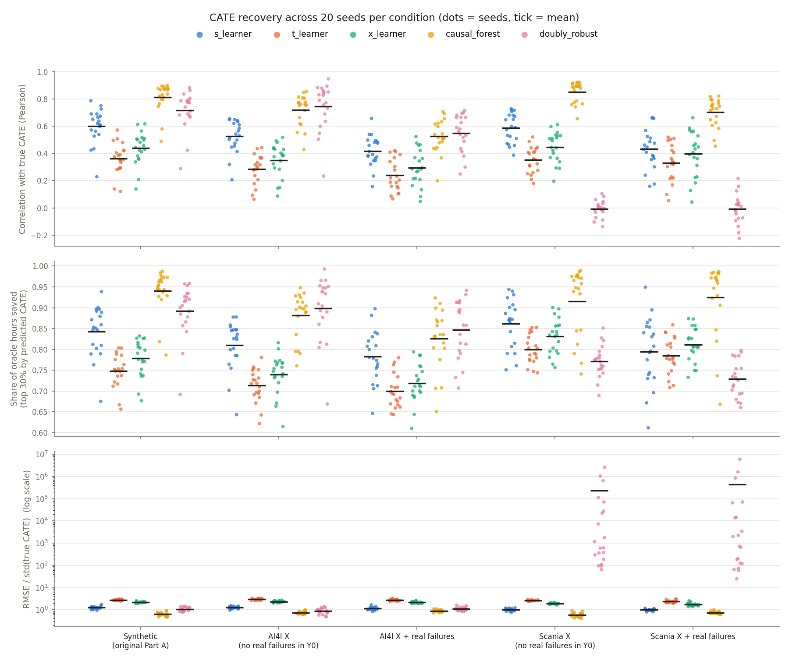
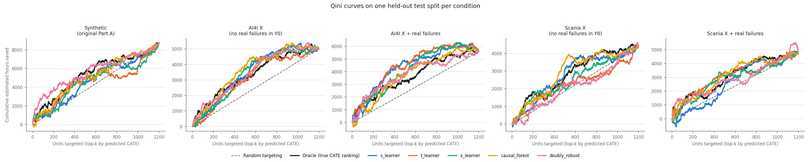

# Resultados semi-sintéticos: los estimadores CATE sobre covariables reales

Este reporte vuelve a evaluar los 5 estimadores CATE de la Parte A con **covariables reales** de mantenimiento predictivo. El tratamiento y el efecto se simulan, de modo que el CATE verdadero sigue siendo conocido y se puede puntuar a cada modelo contra él. Todos los números salen de dos corridas reales:

```powershell
python -m src.data.download_real_data     # descarga Scania APS y AI4I 2020 desde UCI a data/raw/
python -m src.pipeline_real_data           # benchmark: 5 condiciones x 20 semillas x 5 modelos
python -m src.pipeline_dr_ablation         # ablación del DRLearner: 4 condiciones x 20 semillas x 6 brazos
python -m src.evaluation.semi_synthetic_diagnostics
```

Las métricas por semilla quedan en `outputs/reports/semi_synthetic_metrics.csv` y `semi_synthetic_dr_ablation.csv`. Las figuras están en `outputs/figures/semi_synthetic_*.png`.

## Resumen

| Pregunta | Respuesta corta |
|---|---|
| ¿El `DRLearner` es más inestable con datos reales? | **Sí con Scania y no con AI4I.** En Scania colapsa: correlación con el CATE verdadero de −0,01 (frente a 0,72 en el sintético), un 33% de predicciones con signo equivocado y errores de hasta 10⁶ veces la desviación del CATE. En AI4I empata con Causal Forest. No lo rompe que los datos sean "reales" en general. Lo rompen las features de cola pesada y colineales de Scania. Una etapa final Ridge con log1p solo en las columnas asimétricas lo recupera (0,79 / 0,61) sin perjudicar en ninguna otra condición (§4.1). |
| ¿`CausalForestDML` sigue siendo el mejor? | **Es el más robusto, pero no gana en todas partes.** Es el mejor en Scania en 20 de 20 semillas y sigue por delante del mejor DR arreglado en correlación (+0,07 y +0,09, con IC 95% que excluyen el 0), aunque en horas ahorradas al focalizar esa ventaja ya no es significativa. Tiene el mejor peor caso en 4 de las 5 condiciones. En AI4I pierde por 0,05 frente a un DR con etapa final Ridge. |
| ¿Qué cuestan las fallas reales dentro de Y₀? | Todos los modelos caen. CF baja de 0,85 a 0,70 en Scania y de 0,72 a 0,53 en AI4I, bastante por debajo del techo alcanzable (0,96 y 0,92). |

## 1. Datos reales elegidos y por qué

| | **Scania APS** (UCI #421) | **AI4I 2020** (UCI #601) |
|---|---|---|
| Qué es | 60.000 camiones pesados Scania en operación real; falla de un componente del sistema de aire comprimido (APS) | 10.000 registros de proceso de una máquina |
| ¿Son datos reales? | **Sí**: datos operacionales de flota, anonimizados | **No del todo**: su autor lo describe como un dataset *sintético* que imita datos reales de mantenimiento |
| Features que ven los modelos | 170 contadores e histogramas anonimizados (162 tras descartar las columnas con más de 50% de faltantes en train) | 6 interpretables: tipo, temperatura del aire y del proceso, rpm, torque y desgaste de herramienta |
| Tasa de falla real | 1,67% | 3,39% |
| Celdas faltantes | 8,3% | 0% |
| Mediana de \|asimetría\| por feature | **17,5** | 0,03 |
| Máxima \|correlación\| entre dos features | **1,00** (bins de histograma redundantes) | 0,88 |

Scania es la fuente principal: es lo más cercano a una flota CAEX y tiene lo que un DGP sintético no trae (colas extremas, faltantes y colinealidad perfecta). AI4I queda como **control**. Tiene columnas interpretables y un comportamiento casi gaussiano, así que separa el efecto de que los datos sean "reales" del efecto de sus propiedades estadísticas.

No se usó NASA C-MAPSS porque también es una simulación (del modelo termodinámico de un turbofan) y su unidad natural es una serie temporal de degradación, no un corte transversal de equipos.

## 2. Diseño del DGP semi-sintético (`src/data/semi_synthetic_dgp.py`)

Del dataset real se toman **solo X y la falla observada**. El tratamiento y el efecto se simulan. Ningún dataset trae tratamiento, y se supuso que no lo hay.

1. **Muestra**: 3.000 unidades reales sin reemplazo por semilla, el mismo tamaño que el piloto sintético.
2. **Asignación**: aleatorización **completa dentro de bloques**, con exactamente `round(p_b · n_b)` tratados por bloque y p_b = 0,45 / 0,50 / 0,55. Los bloques son el tipo de máquina en AI4I y los terciles de uso (`aa_000`) en Scania. La propensión depende de X, igual que en la Parte A por sitio.
3. **Línea base** (resultado sin tratamiento): `μ₀(x) = 20·exp(0,25·z_desgaste + 0,20·z_estrés + 0,15·z_carga) + 60·F`, donde `F` es la **falla real** del registro. Los drivers son columnas reales (AI4I: desgaste de herramienta, temperatura de proceso y torque; Scania: `aa_000`, `ci_000` y `bj_000`) estandarizadas con mediana e IQR, pasadas por log1p en Scania y recortadas a ±3.
4. **Efecto heterogéneo**: una reducción proporcional `r(x) = clip(0,18 + 0,06·z_desgaste + 0,05·z_estrés, 0,03, 0,55)`, mayor en equipos más gastados y más exigidos. El **CATE verdadero** es `r(x)·μ₀(x)` horas ahorradas.
5. **Resultado**: `Y ~ Gamma(forma 2,2, media μ₀ o μ₀·(1−r))`, la misma forma que el piloto sintético.

Hay una decisión que se aparta del esqueleto propuesto: **el resultado no se recorta con `max(0, Y₀ − τ)`**. Ese recorte cambia el efecto real de cada unidad recortada, y entonces `true_cate_hours` deja de ser verdad justo en las unidades con menos downtime. El efecto multiplicativo mantiene Y > 0 por construcción, sin recorte. Tampoco se usó `binomial(0,5)` para asignar, porque eso no es aleatorización por bloques.

### Condiciones comparadas

Todas tienen n = 3.000, split estratificado 60/40 (1.800 de train y 1.200 de test), el mismo preprocesamiento (imputación por mediana ajustada solo en train) y los mismos 5 modelos. Se corrieron **20 semillas por condición**: cada semilla re-sortea la muestra real, la asignación, el ruido y el split.

| Condición | Qué cambia respecto de la anterior |
|---|---|
| `synthetic` | El piloto 100% sintético original (`simulate_rct`) |
| `ai4i_x` / `scania_x` | Covariables reales y línea base suave, **sin** fallas reales en Y₀ |
| `ai4i_xy` / `scania_xy` | Lo mismo **más** las fallas reales en Y₀ |

La comparación más limpia es **`ai4i_x` frente a `scania_x`**: el mismo código de DGP y la misma forma funcional, cambiando solo las covariables reales. La comparación `synthetic` → `*_x` cambia a la vez X y la forma funcional del DGP (el sintético tiene su propio efecto por edad y utilización y un ATE de 7,3 h, frente a 3–4 h), así que no aísla una sola variable.

## 3. Resultados del benchmark

Medias sobre 20 semillas. La desviación estándar entre semillas va entre paréntesis. "Mejor en" cuenta en cuántas semillas el modelo tuvo la mayor correlación.

### Correlación de Pearson con el CATE verdadero

| Modelo | synthetic | ai4i_x | ai4i_xy | scania_x | scania_xy |
|---|---|---|---|---|---|
| S-learner | 0,600 (0,13) | 0,526 (0,12) | 0,417 (0,11) | 0,588 (0,11) | 0,433 (0,15) |
| T-learner | 0,363 (0,11) | 0,284 (0,11) | 0,239 (0,12) | 0,352 (0,10) | 0,331 (0,14) |
| X-learner | 0,438 (0,12) | 0,350 (0,12) | 0,295 (0,13) | 0,447 (0,11) | 0,396 (0,17) |
| **Causal Forest DML** | **0,813** (0,11) | 0,719 (0,11) | 0,525 (0,12) | **0,853** (0,08) | **0,702** (0,10) |
| DRLearner | 0,718 (0,14) | **0,746** (0,17) | **0,550** (0,14) | **−0,007** (0,06) | **−0,008** (0,11) |
| *Mejor en (CF / DR)* | 19 / 1 | 7 / 13 | 6 / 13 | 20 / 0 | 20 / 0 |

### Diferencia pareada CF − DR (misma semilla y mismo split), IC 95% t sobre 20 semillas

| Condición | Pearson | Spearman | Valor de la política (30% presupuesto) |
|---|---|---|---|
| synthetic | +0,095 [+0,054, +0,137] | +0,050 [+0,014, +0,086] | +0,048 [+0,025, +0,071] |
| ai4i_x | −0,028 [−0,091, +0,035] | −0,031 [−0,102, +0,040] | −0,017 [−0,049, +0,014] |
| ai4i_xy | −0,025 [−0,069, +0,019] | −0,023 [−0,076, +0,030] | −0,021 [−0,052, +0,010] |
| scania_x | **+0,859** [+0,824, +0,895] | +0,659 [+0,610, +0,708] | +0,144 [+0,113, +0,175] |
| scania_xy | **+0,711** [+0,660, +0,761] | +0,711 [+0,665, +0,758] | +0,195 [+0,154, +0,236] |

En AI4I el DR "gana" en 13 de 20 semillas, pero el intervalo incluye el 0: es un **empate**, no una ventaja del DR.

### Estabilidad y focalización

| Métrica (media / peor semilla) | Modelo | synthetic | ai4i_x | ai4i_xy | scania_x | scania_xy |
|---|---|---|---|---|---|---|
| % predicciones con signo equivocado (el CATE verdadero es siempre > 0) | CF | 0,2 / 2,7 | 0,3 / 3,8 | 0,6 / 2,7 | 2,8 / 14,0 | 2,2 / 10,4 |
| | DR | 12,3 / 19,4 | 11,1 / 22,3 | 16,9 / 27,4 | **32,7 / 44,0** | **34,4 / 48,0** |
| RMSE / desv. del CATE verdadero (mediana en DR) | CF | 0,63 | 0,74 | 0,89 | 0,60 | 0,75 |
| | DR | 1,05 | 0,87 | 1,07 | **892** | **1.369** |
| Rango predicho p1–p99 / rango verdadero | CF | 0,71 | 0,59 | 0,46 | 0,64 | 0,38 |
| | DR | 1,41 | 1,23 | 0,94 | 23,1 | 15,2 |
| Horas ahorradas / oráculo, con el 30% de la flota | CF | 0,940 | 0,881 | 0,826 | 0,916 | 0,924 |
| | DR | 0,893 | 0,898 | 0,847 | 0,771 | 0,729 |



### Curvas Qini



El Qini se recalculó en todas las condiciones, normalizado por el Qini del ranking verdadero sobre las mismas unidades de test. Su desviación entre semillas va de **0,22 a 1,49**, contra 0,06–0,17 de la correlación. En el panel de AI4I con fallas reales, la curva **oráculo** (el ranking por el CATE verdadero) queda por debajo de varios modelos. El Qini se calcula con resultados realizados y ruidosos, así que **en un solo split no sirve para ordenar modelos**, lo que confirma con 20 semillas la advertencia del README sobre el Qini de un único split.

## 4. ¿Por qué se rompe el DRLearner en Scania? Ablación

Hipótesis planteadas antes de correr la ablación (`src/pipeline_dr_ablation.py`). Todos los brazos comparten la muestra, el split, la imputación y los modelos de nuisance. Solo cambia la etapa final o la transformación de X.

- **H1, colas pesadas**: la etapa final lineal (OLS) extrapola en camiones de test con contadores extremos. Brazo de prueba: log1p con signo sobre todas las features.
- **H2, colinealidad**: con 162 features y bins redundantes (r = 1,0), los coeficientes de OLS tienen varianza enorme. Brazo de prueba: etapa final `RidgeCV` sobre features estandarizadas.
- **Control**: la etapa final LightGBM que el proyecto había descartado con datos sintéticos, para ver si ese descarte se sostiene con datos reales.

Correlación de Pearson, media sobre 20 semillas (entre paréntesis la desviación entre semillas):

| Brazo | synthetic | ai4i_xy | scania_x | scania_xy |
|---|---|---|---|---|
| `dr_ols_raw` (el DR del proyecto) | 0,718 | 0,550 | −0,007 | −0,008 |
| `dr_ols_log` (prueba H1) | 0,661 | 0,465 | 0,119 | 0,090 |
| `dr_ridge_raw` (prueba H2) | **0,815** | **0,575** | 0,322 (0,28) | 0,251 (0,27) |
| `dr_ridge_log` (H1 + H2) | 0,732 | 0,488 | 0,782 | 0,609 |
| `dr_lgbm_raw` (etapa final flexible) | 0,281 | 0,206 | 0,285 | 0,241 |
| Causal Forest DML (referencia) | 0,813 | 0,525 | **0,853** | **0,702** |

Diferencia pareada de CF frente al mejor DR arreglado (`dr_ridge_log`) en Scania: **+0,070 [+0,033, +0,107]** en `scania_x` y **+0,093 [+0,028, +0,159]** en `scania_xy`.

Lectura:

1. **H1 sola queda refutada** como causa suficiente: el log mueve la correlación de −0,01 a 0,12.
2. **H2 sola es parcial e inestable**: Ridge llega a 0,32 de media en `scania_x`, pero oscila entre −0,08 y 0,77 según la semilla.
3. **Las dos juntas recuperan la mayor parte** (0,78 / 0,61). Las colas y la colinealidad actúan a la vez: la estandarización previa a Ridge queda dominada por los outliers si no se comprimen primero las colas.
4. **El descarte de la etapa final LightGBM se sostiene con datos reales**: es la peor opción en las cuatro condiciones.
5. **Ninguno de estos brazos sirve en todas las condiciones.** El log global *empeora* al DR donde las features no tienen colas (sintético: 0,73 frente a 0,82; AI4I: 0,49 frente a 0,58), porque ahí el efecto es aproximadamente lineal en la escala original. En cambio, **Ridge sobre X crudo empata con CF en el sintético (−0,001 [−0,045, +0,042]) y le gana en AI4I (−0,050 [−0,089, −0,011])**. La etapa final OLS actual deja rendimiento sobre la mesa incluso en los datos donde se validó. §4.1 prueba la configuración que combina ambos.

### 4.1 Variante final: Ridge con log1p solo en las columnas asimétricas

Hipótesis: aplicar log1p **solo** a las columnas con cola pesada debería conservar la ganancia en Scania sin el costo que el log global tiene en los datos bien comportados. Si además la brecha con CF fuera solo de preprocesamiento, debería cerrarse.

Implementación (`build_skew_aware_ridge` en `src/pipeline_dr_ablation.py`): un `ColumnTransformer` aplica log1p con signo a las columnas con |asimetría| > umbral y deja el resto sin tocar; después vienen `StandardScaler` y `RidgeCV`. La asimetría se calcula en el `fit` de la etapa final, es decir, **solo con train**. El umbral **|skew| > 1** se fijó antes de correr; 0,5, 2 y 5 se corrieron como sensibilidad. Los modelos de nuisance son los mismos que en el resto de la ablación. Los 480 resultados de los brazos anteriores se reprodujeron idénticos en esta corrida (diferencia máxima 4·10⁻¹⁶).

| | synthetic | ai4i_xy | scania_x | scania_xy |
|---|---|---|---|---|
| Columnas con \|skew\| > 1 en train (semilla 100) | 6 de 10 (5 dummies + `prior_90d_downtime_hours`) | 1 de 7 | 156 de 162 | 156 de 162 |
| Pearson `dr_ridge_skewlog` (sd) | 0,816 (0,14) | 0,577 (0,13) | 0,788 (0,07) | 0,609 (0,10) |
| Peor semilla | 0,273 | 0,207 | 0,591 | 0,392 |
| NRMSE máximo (DR original) | 1,04 (1,42) | 1,43 (1,62) | 1,34 (2,6·10⁶) | 2,27 (6,1·10⁶) |
| % signo equivocado (CF) | 2,7 (0,2) | 4,5 (0,6) | 6,8 (2,8) | 9,0 (2,2) |
| Semillas con Pearson > 0,75 | 18/20 | 0/20 | 16/20 | 0/20 |
| vs `dr_ridge_log` (Pearson, pareado) | **+0,084** [+0,076, +0,093] | **+0,088** [+0,069, +0,107] | +0,005 [−0,006, +0,017] | 0,000 [−0,001, +0,001] |
| CF − skewlog, Pearson | −0,003 [−0,047, +0,041] | **−0,052** [−0,090, −0,013] | **+0,065** [+0,026, +0,103] | **+0,094** [+0,028, +0,160] |
| CF − skewlog, horas ahorradas con el 30% | +0,003 [−0,021, +0,027] | **−0,039** [−0,071, −0,007] | +0,003 [−0,034, +0,040] | +0,029 [−0,024, +0,083] |

Sensibilidad al umbral (Pearson medio para 0,5 / 1 / 2 / 5): Scania X 0,783 / 0,788 / 0,791 / 0,788; Scania X+fallas 0,610 / 0,609 / 0,609 / 0,618; AI4I 0,577 / 0,577 / 0,576 / 0,575; sintético **0,734** / 0,816 / 0,817 / 0,815. En Scania más del 90% de las columnas supera cualquier umbral, así que da lo mismo cuál se use. En el sintético, un umbral de 0,5 empieza a comprimir `truck_age_years` (|skew| 0,69) y `cumulative_hours_1000s` (0,80), que entran en el CATE verdadero en su escala original: la edad a través de la reducción r(x) y las horas acumuladas a través de la línea base. Con eso cae al nivel del log global. En una dummy, en cambio, el log1p es una transformación afín y no cambia nada después de estandarizar.

Lectura:

1. **Es la primera configuración del DR que no pierde en ninguna condición.** En Scania iguala al log global (el log selectivo y el global coinciden porque casi todo es asimétrico). En el sintético y en AI4I iguala a Ridge sobre X crudo y evita la pérdida de 0,08–0,09 del log global.
2. **El colapso no era inherente a la doble robustez**: con la etapa final adecuada, el DR pasa de −0,01 a 0,79 en Scania, con varianza entre semillas equivalente a la de CF y sin predicciones extremas.
3. **La brecha con CF en recuperación del CATE no era solo preprocesamiento: esa hipótesis queda refutada.** CF sigue por delante en Scania en correlación (+0,065 y +0,094, IC sin el 0) y en signos equivocados (2–3% frente a 7–9%). Queda un límite de la etapa final lineal: con features log-transformadas y un efecto que es no lineal en ellas, Ridge no alcanza a un forest que ajusta la forma localmente.
4. **Para la decisión de negocio la brecha deja de ser significativa**: en horas ahorradas al tratar el 30% de la flota según el ranking, CF y el DR skew-aware no se distinguen en Scania. El DR además *gana* en AI4I.
5. **No llega a 0,75 cuando entran las fallas reales** (`scania_xy`: 0,609, ninguna semilla sobre 0,75). CF tampoco: su media es 0,702.

## 5. Conclusiones

1. **La inestabilidad del DRLearner depende de la forma de las features, no de que sean "reales".** Con el mismo DGP, pasar de AI4I a Scania lleva su correlación de 0,75 a −0,01. El arreglo documentado en el README (etapa final lineal y `min_propensity=0,1`) se validó sobre features bien comportadas y **no generaliza** a contadores de cola pesada y colineales. Una etapa final Ridge con log1p solo en las columnas asimétricas (§4.1) lo recupera en Scania (0,79 / 0,61) y no empeora en ninguna otra condición. Es la configuración recomendada si el DR se usa con datos de sensores. `DoublyRobustModel` todavía no la tiene por defecto; hoy vive en el script de ablación.
2. **Causal Forest DML es la opción más segura, pero no la mejor en todo.** En Scania su peor semilla es 0,65 / 0,45, frente a −0,14 / −0,22 del DR original, y tiene la mejor peor semilla en 4 de las 5 condiciones. Frente al DR skew-aware conserva la ventaja en recuperación del CATE en Scania (+0,065 / +0,094), pero no en horas ahorradas al focalizar, donde la diferencia no es significativa. No es inmune a una mala semilla: en `ai4i_xy` tuvo una de 0,20, y ahí el peor DR (0,25) fue algo mejor. En AI4I, además, un DR con Ridge lo supera. La conclusión que se sostiene es "el más robusto", no "el mejor en todo".
3. **CF comprime las magnitudes**: su rango predicho es el 38–71% del verdadero. Ordena bien (Spearman de 0,89 en `scania_xy`) pero subestima los efectos extremos, que en `*_xy` son los equipos con falla real. Esa compresión es la mayor parte de la brecha entre su Pearson (0,70) y su Spearman (0,89). Para decidir **a quién** tratar sirve. Para estimar **cuántas horas** se ahorran por equipo, hay que calibrarlo.
4. **Las fallas reales en Y₀ son la parte difícil**: explican el 30–38% de la varianza del CATE. Al incluirlas, CF, el DR (en AI4I) y el S-learner pierden entre 0,11 y 0,20 de correlación, y T y X entre 0,02 y 0,06, porque ya partían bajos. El techo alcanzable, un modelo que conoce r(x) y la línea base exacta pero debe predecir la falla desde X, es de 0,96 en Scania y 0,92 en AI4I.
5. **Entre los meta-learners el orden es S > X > T en las cinco condiciones**; no cambió con datos reales. En Scania el S-learner queda segundo, detrás de CF, porque el DR cae al último lugar.

## 6. Limitaciones

- **El efecto sigue siendo simulado.** Los datos reales ponen a prueba a los estimadores frente a distribuciones reales de X, pero la forma de r(x) la eligió este proyecto. Un efecto real podría depender de variables no observadas.
- **Los drivers de Scania están anonimizados**: `aa_000`, `ci_000` y `bj_000` se usan como proxies de uso y carga sin saber qué miden físicamente.
- **AI4I no es un dataset real** (ver §1). Sirve como control de features bien comportadas, no como evidencia sobre sensores reales.
- **Pocas fallas en test**: los splits de Scania tienen entre 12 y 30 camiones con falla real, y los de AI4I entre 33 y 54. Las métricas de `*_xy` sobre la cola de fallas descansan en pocas unidades por semilla. Por eso se promedian 20 semillas.
- **El techo de §5.4 es generoso**: el clasificador de fallas se entrenó con validación cruzada sobre todo el dataset real (48.000 u 8.000 filas por fold), frente a las 1.800 filas de train que tienen los estimadores.
- **Split aleatorio**: las filas de AI4I forman una secuencia de procesos (el desgaste se acumula entre registros vecinos). Como el tratamiento, el efecto y el ruido se sortean por fila y no hay predicción hacia adelante, el split aleatorio no filtra información del resultado. Aun así, las unidades de train y test no son independientes en X.
- **Hiperparámetros sin ajustar**: los 5 modelos usan la configuración del pipeline sintético. La ablación del DR muestra que eso puede importar mucho.
- **Semillas distintas a las del README**: el README reporta la semilla 42 en un solo split (CF 0,888, DR 0,80). Con 20 semillas en el mismo DGP sintético, las medias son 0,813 y 0,718, así que los números del README están del lado optimista de su propia distribución.
